# Argus UML 圖集

本文件收錄 `Argus_系統手冊_第三章優化版.docx` 與後續系統手冊圖說可使用的 PlantUML 原始碼。為了相容 PlantUML 1.2026.4beta4，本文件不在圖內使用 `title` 指令，圖名統一放在 Markdown 標題中。

## 圖 3-1-1 Argus SaaS 分層系統架構圖

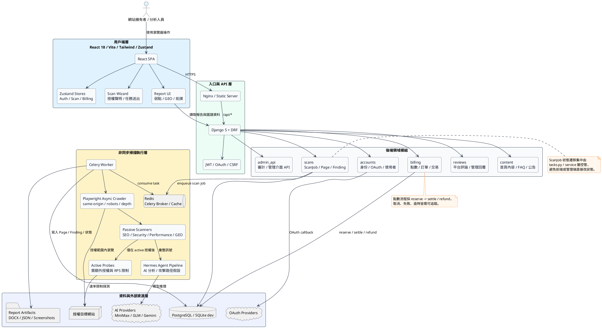

## 圖 3-1-2 掃描任務執行資料流圖

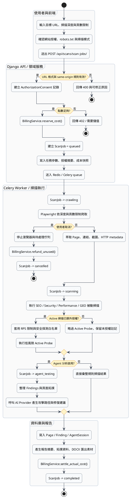

## 圖 3-1-3 ScanJob 核心狀態與橫切機制圖

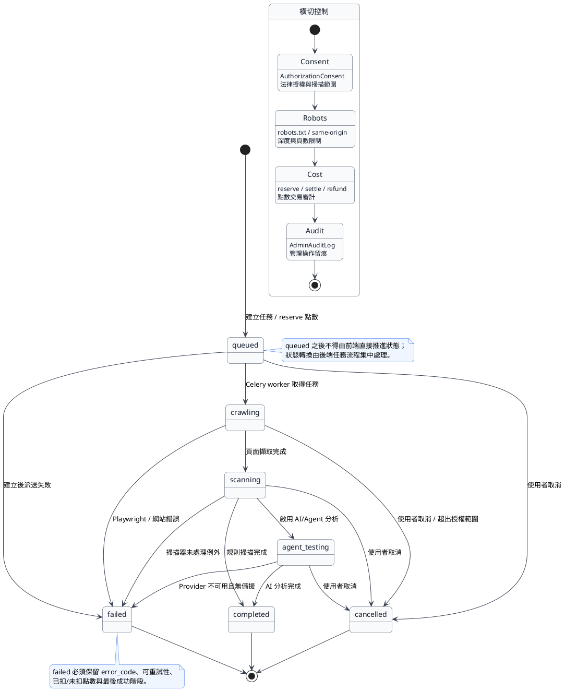

## 圖 5-2-1 使用個案圖

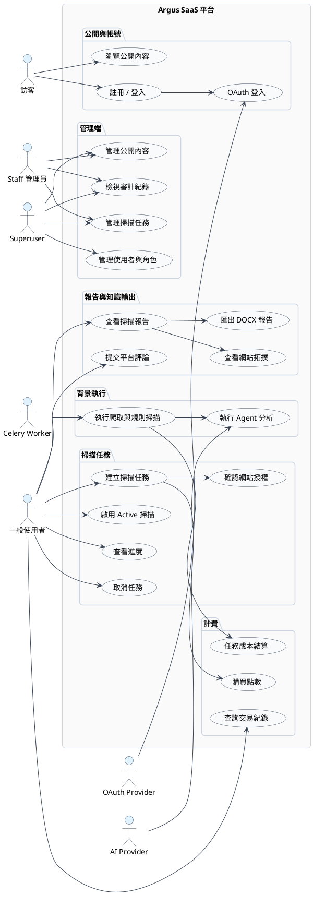

## 圖 5-3-1 活動圖：提交掃描任務

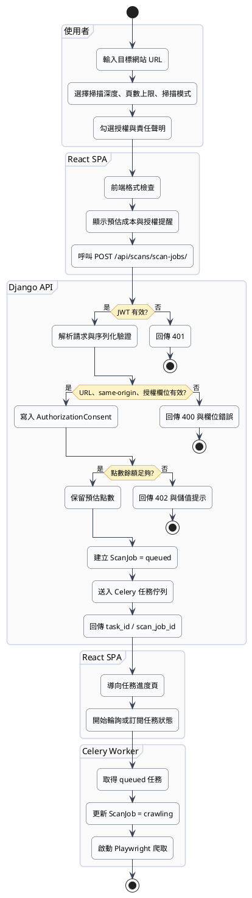

## 圖 5-4-1 分析類別圖

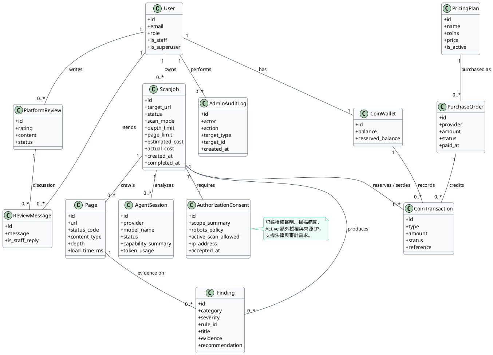

## 圖 6-1-1 掃描任務循序圖

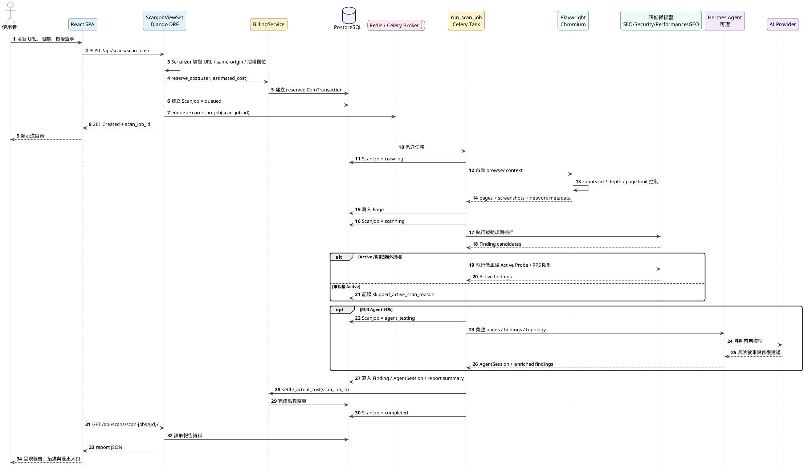

## 圖 6-2-1 設計類別圖

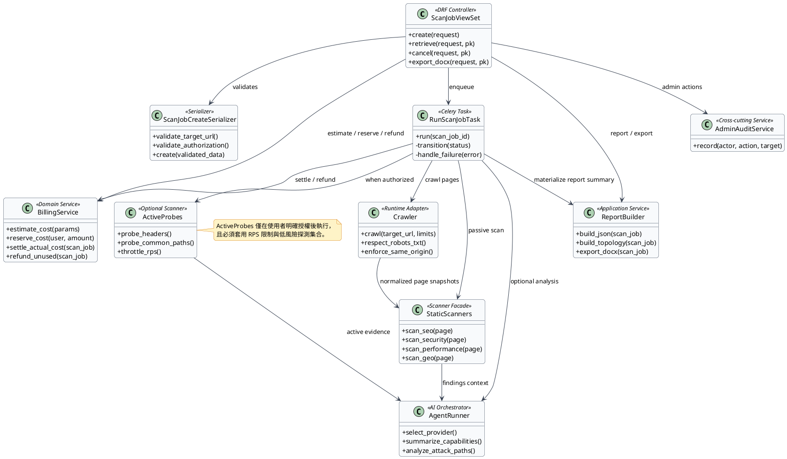

## 圖 7-1-1 Docker Compose 佈署圖

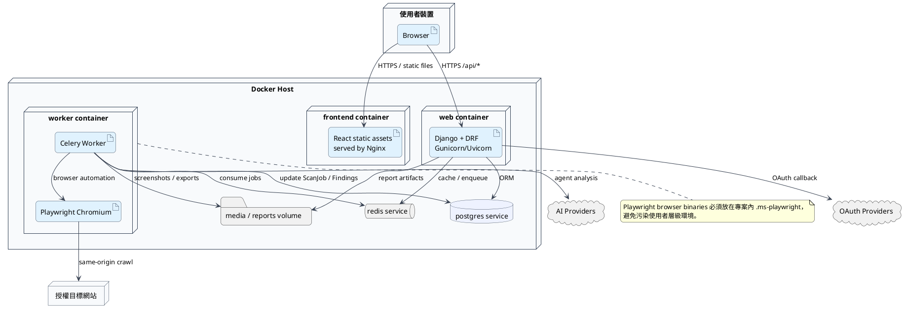

## 圖 7-2-1 套件架構圖

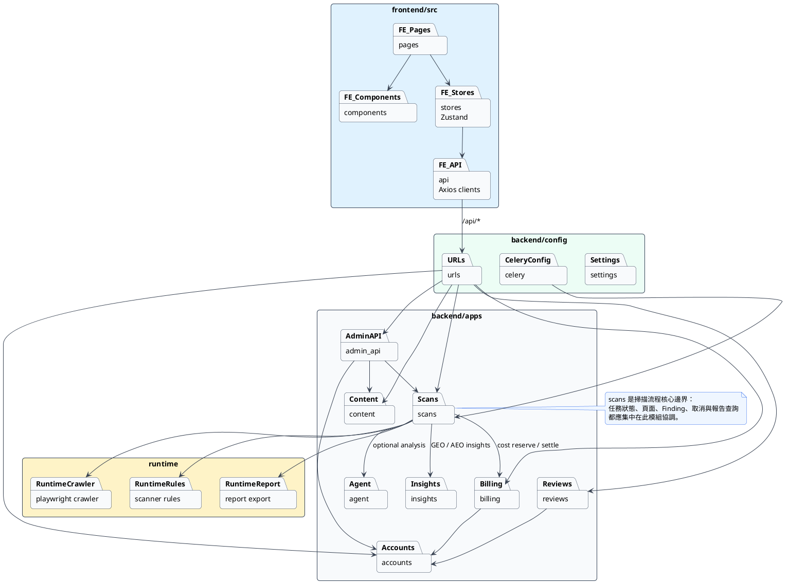

## 圖 7-3-1 系統元件圖

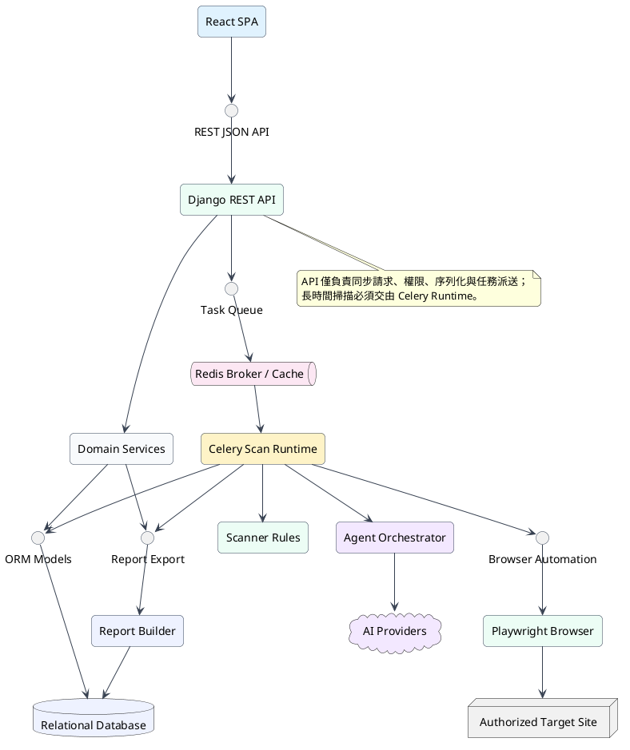

## 圖 7-4-1 ScanJob 狀態機圖

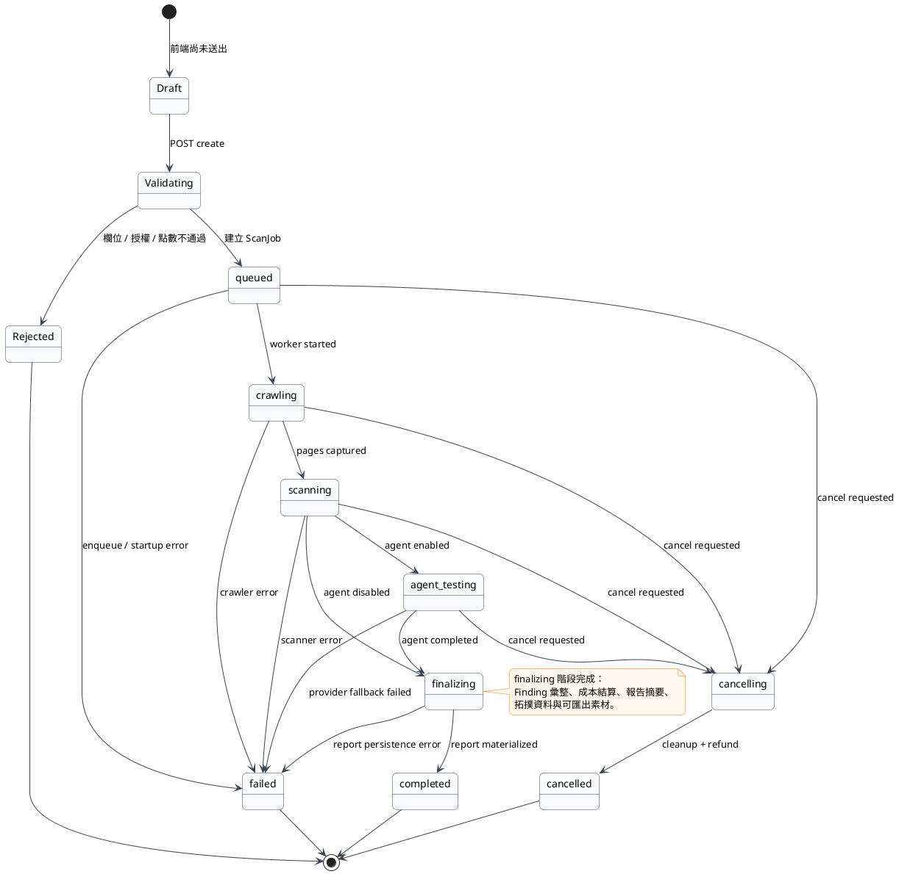

## 圖 8-1-1 資料庫 ER 圖

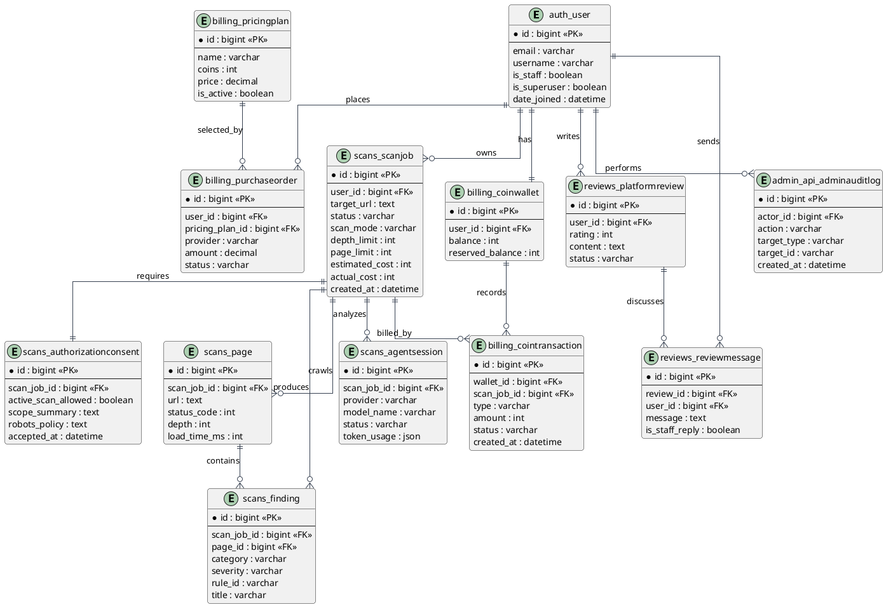
