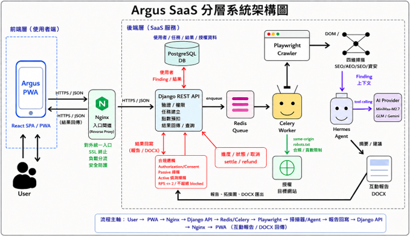

# Argus — AI 網站全方位健檢平台


> **輸入一個網址，Argus 自動執行全站爬蟲、四維分析與 AI 動態測試，產出可互動報告、Word 文件，以及能直接貼進 ChatGPT / Claude 的結構化問題 Prompt。**

---

## 目錄

- [Argus — AI 網站全方位健檢平台](#argus--ai-網站全方位健檢平台)
  - [目錄](#目錄)
  - [專案簡介](#專案簡介)
  - [功能特色](#功能特色)
    - [核心掃描能力](#核心掃描能力)
    - [平台功能](#平台功能)
  - [技術棧](#技術棧)
  - [系統架構](#系統架構)
  - [快速開始](#快速開始)
    - [先決條件](#先決條件)
    - [1. 複製專案](#1-複製專案)
    - [2. 安裝依賴](#2-安裝依賴)
    - [3. 設定環境變數](#3-設定環境變數)
    - [4. 初始化資料庫](#4-初始化資料庫)
    - [5. Build 前端並啟動](#5-build-前端並啟動)
    - [6. 驗證環境](#6-驗證環境)
  - [Docker 部署](#docker-部署)
  - [API 總覽](#api-總覽)
    - [認證](#認證)
    - [掃描](#掃描)
    - [點數與訂單](#點數與訂單)
    - [評論](#評論)
  - [點數制度](#點數制度)
  - [法律與倫理機制](#法律與倫理機制)
  - [專案結構](#專案結構)
  - [License](#license)

---

## 專案簡介

**Argus** 是 SaaS 級授權式網站健檢工具。使用者輸入目標網址並確認授權後，系統自動執行：

1. **全站爬蟲**：Playwright Chromium headless，BFS 廣度優先，同網域最多 50 頁 / 深度 3 層，遵守 `robots.txt`
2. **四維靜態掃描**：SEO × AEO × GEO × 被動資安，每個問題產出嚴重度、修補建議與 AI Handoff Prompt
3. **Hermes-Agent 動態 UX 測試**（Phase 2）：LLM 驅動 Playwright 擬真使用者操作，自動回報流程斷點與 UI 缺陷
4. **可互動工作區**：長截圖 + Canvas 高光標示 + 側邊欄 Findings 列表，支援篩選與一鍵複製問題 Prompt
5. **Word 報告匯出**：封面 → 摘要統計 → 逐頁問題條列 → 附錄，由 `python-docx` 產生

---

## 功能特色

### 核心掃描能力

| 維度 | 說明 | 範例檢測項目 |
|------|------|-------------|
| **SEO** | 搜尋引擎最佳化 | Meta title/description 長度、H1-H6 層級、alt 屬性、canonical、hreflang |
| **AEO** | 答案引擎最佳化 | FAQ Schema、HowTo Schema、`<dl>` 問答結構 |
| **GEO** | AI 生成最佳化 | JSON-LD 完整度、段落語意密度、可被 RAG 擷取的結構化區塊 |
| **資安（被動）** | 無破壞性安全偵測 | HTTPS/HSTS/CSP、X-Frame-Options、Cookie HttpOnly/Secure/SameSite、`.git`/`.env` 外洩偵測 |

每筆 Finding 包含：`severity`（critical / high / medium / low / info）、`description`、`remediation`、`evidence`、`bounding_box`，以及可直接複製的 `ai_handoff_prompt`。

### 平台功能

- **Google OAuth 登入** + JWT 認證
- **PWA 支援**：可一鍵安裝至桌面 / 手機主畫面，支援離線 cache
- **點數錢包系統**：月贈 200 coin、4 個購點方案、掃描預扣 + 依實際頁數退差
- **Trustpilot 風格評論**：一人一評 + 討論 thread + 圖片上傳 + 有幫助點讚
- **React 管理後台**：使用者管理、點數調整、評論回覆、掃描監控、CMS 內容編輯
- **完整稽核軌跡**：`AdminAuditLog` 記錄所有後台操作（superuser 限定查詢）

---


## 技術棧

| 層級 | 套件 / 工具 |
|------|------------|
| **前端** | React 18 (Vite 6)、Tailwind CSS、Zustand、Axios、react-router-dom v7、ReactFlow（拓樸圖）、@react-oauth/google |
| **後端** | Django 5 + Django REST Framework、SimpleJWT、google-auth、Pillow、python-docx、python-dotenv |
| **任務佇列** | Celery + Redis |
| **爬蟲** | Playwright Python async（Chromium headless） |
| **資料庫** | SQLite（開發）/ PostgreSQL（正式） |
| **AI Agent** | MiniMax-M2.7 優先 → GLM glm-4.7-flash → Gemini 備援（OpenAI-compatible tool calling） |
| **部署** | Docker Compose（web / worker / redis / db / nginx） |
| **程式碼品質** | ruff（backend lint）、192 個後端自動化測試 |

---

## 系統架構

```
使用者輸入網址
      │
      ▼
┌─────────────────────────────────────────────────┐
│  前端（React 18 + Vite）                          │
│  /login  /scans  /scans/:id  /scans/:id/topology │
│  /admin/*（React 管理後台）                       │
└───────────────────┬─────────────────────────────┘
                    │ REST API (JWT)
                    ▼
┌─────────────────────────────────────────────────┐
│  後端（Django 5 + DRF）                           │
│                                                  │
│  accounts │ scans   │ billing  │ reviews         │
│  agent    │ admin_api│ content │                 │
└───────────────────┬─────────────────────────────┘
                    │ Celery Task
                    ▼
┌─────────────────────────────────────────────────┐
│  Worker（Celery + Redis）                         │
│                                                  │
│  1. Playwright BFS 爬蟲                           │
│     → 截圖、HTML、DOM、拓樸連結                    │
│  2. 四維 Scanner                                  │
│     → Finding（severity / bounding_box / prompt）│
│  3. Hermes-Agent（Phase 2，預設關閉）              │
│     → LLM tool calling + UX Finding              │
│  4. billing 結算（預扣 → 按實際頁數退差）           │
└─────────────────────────────────────────────────┘
                    │
                    ▼
        DB（SQLite / PostgreSQL）
        Media（截圖、評論圖片）
```

---

## 快速開始

### 先決條件

- Python ≥ 3.13
- Node.js ≥ 18
- [`uv`](https://docs.astral.sh/uv/)（Python 套件管理）
- Redis（本機或 Docker）

### 1. 複製專案

```bash
git clone https://github.com/Djude1/OpenAIDevice_For_VisualImpairment.git
cd OpenAIDevice_For_VisualImpairment
```

### 2. 安裝依賴

```bash
# 後端
uv sync

# 前端
cd frontend && npm install && cd ..

# Playwright（必須裝在專案內，禁止污染全域）
PLAYWRIGHT_BROWSERS_PATH=".ms-playwright" uv run playwright install chromium
```

### 3. 設定環境變數

```bash
cp .env.example .env
```

`.env` 最小設定：

```env
DJANGO_SECRET_KEY=<64-byte random string>
DJANGO_DEBUG=true
DJANGO_ALLOWED_HOSTS=localhost,127.0.0.1
JWT_SECRET_KEY=<64-byte random string>
GOOGLE_OAUTH_CLIENT_ID=<從 Google Cloud Console 取得>
ARGUS_AGENT_ENABLED=false
```

### 4. 初始化資料庫

```bash
# 套用 migration（含自動 seed：PricingPlan、CMS 內容）
uv run python backend/manage.py migrate

# 建立 superuser
uv run python backend/manage.py createsuperuser
```

### 5. Build 前端並啟動

```bash
# Build 前端
cd frontend && npm run build && cd ..

# 啟動（Django 直接 serve 前端 dist，單一命令即可）
uv run python backend/manage.py runserver 127.0.0.1:8000
```

打開 [http://127.0.0.1:8000](http://127.0.0.1:8000)：

| URL | 說明 |
|-----|------|
| `/project` | 公開介紹頁（未登入預設跳轉） |
| `/login` | Google OAuth 登入 |
| `/scans` | 掃描列表（登入後） |
| `/admin/overview` | React 管理後台（staff 限定） |
| `/django-admin/` | Django Admin 後門（superuser） |

### 6. 驗證環境

```bash
uv run python backend/manage.py check          # Django 自我檢查
uv run python backend/manage.py test apps      # 預期 192/192 全綠
uv run ruff check backend                      # 預期 All checks passed
```

---

## Docker 部署

```bash
# 完整部署（含 nginx 反向代理）
docker compose up -d --build

# 前端更新後
docker compose up -d --build frontend
```

| 服務 | 說明 |
|------|------|
| `web` | Django + Gunicorn |
| `worker` | Celery 任務 worker |
| `redis` | Broker + 結果後端 |
| `db` | PostgreSQL |
| `nginx` | 反向代理（port 80） |

---

## API 總覽

### 認證
```
POST /api/auth/google/               Google ID Token → JWT
```

### 掃描
```
GET  /api/scans/                     列表
POST /api/scans/                     建立（含 coin 預扣）
GET  /api/scans/{id}/                詳情
GET  /api/scans/{id}/status/         即時進度（含 progress JSON）
POST /api/scans/{id}/cancel/         終止（自動退款）
GET  /api/scans/{id}/topology/       網站拓樸圖（nodes + edges）
GET  /api/scans/{id}/report/         下載 Word 報告（.docx）
GET  /api/findings/?scan_id=         Findings 列表
```

### 點數與訂單
```
GET  /api/billing/wallet/            我的錢包（餘額 + 最近 20 筆交易）
GET  /api/billing/plans/             4 個購點方案
POST /api/billing/purchase/          結帳
GET  /api/billing/orders/            訂單紀錄
```

### 評論
```
GET  /api/reviews/                   全部評論（公開）
POST /api/reviews/mine/              新增我的評論
POST /api/reviews/{id}/messages/     回覆討論（支援圖片）
POST /api/reviews/{id}/helpful/      點讚
```

---

## 點數制度

| 方案 | 價格 | 點數 |
|------|------|------|
| 入門 | NT$ 100 | 100 coin |
| 標準 | NT$ 450 | 500 coin（-10%） |
| 進階 | NT$ 800 | 1,000 coin（-20%，前端推薦） |
| 旗艦 | NT$ 1,500 | 2,200 coin（-32%） |

- 每月登入自動獲得 **200 coin**
- 掃描費用：**每頁 10 coin**（建立時預扣 `max_pages × 10`，完成後按實際頁數退差，失敗 / 取消全退）

---

## 法律與倫理機制

Argus 內建以下合規機制，確保所有掃描均在授權範圍內執行：

1. **授權確認**：送出掃描前必須勾選授權同意書，後端記錄 IP、timestamp、user_id
2. **爬蟲範圍限制**：預設同網域、深度 3 層、最多 50 頁，遵守 `robots.txt`
3. **被動模式預設**：只分析 response header 與 HTML，不發送任何惡意 payload
4. **主動測試需額外授權**：SQLi 偵測等需另外勾選同意，RPS ≤ 2，僅使用無破壞性 payload
5. **自訂 User-Agent**：`SiteSense-AI-Scanner/1.0 (authorized-audit)`

---

## 專案結構

```
Argus/
├── backend/
│   ├── config/              Django 主設定、路由、Celery
│   └── apps/
│       ├── accounts/        User 模型、Google OAuth
│       ├── scans/           核心：爬蟲、掃描器、報告、取消機制
│       ├── agent/           Hermes-Agent（Phase 2）
│       ├── billing/         點數錢包、交易、訂單
│       ├── reviews/         平台評論 + Thread
│       ├── admin_api/       React 後台 API + 稽核日誌
│       └── content/         CMS（特色、團隊、版本紀錄）
├── frontend/
│   └── src/
│       ├── App.jsx          所有頁面與元件（4500+ 行）
│       ├── api.js           Axios 統一封裝
│       ├── store.js         Zustand 全域狀態
│       └── styles.css       Tailwind + 元件樣式
├── docs/                    設計文件與規格
├── log/                     開發日誌（每次任務後記錄）
├── docker-compose.yml
├── Dockerfile
├── pyproject.toml
└── .env.example
```

---

## License

MIT License — 詳見 [LICENSE](LICENSE)
