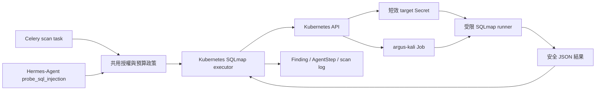

# K8s Kali SQLmap Job 設計規格

**日期**：2026-07-14

**狀態**：設計已核准，等待使用者審閱書面規格

**範圍**：恢復並改良 SQLmap 主動驗證；Metasploit、Nmap 與多 Job 併發不在本輪

## 背景與已確認事實

Argus 原有 Kali 攻擊鏈以 `docker exec argus-kali-1 ...` 執行，適用明確疊加
`docker-compose.attack.yml` 的隔離 Compose demo，不適用目前的 Kubernetes 正式環境。

2026-07-14 的 repo 與正式叢集檢查確認：

- 正式 Kubernetes client／server 均為 `v1.35.6`，三個節點使用 containerd 2.2.5。
- `argus` namespace 沒有 Kali Job、Pod 或 Deployment。
- worker 有 Docker CLI，但沒有 Docker socket／daemon，也沒有 sqlmap、msfconsole 或 nmap。
- worker 使用 `argus:default` ServiceAccount；此身份不能建立、查詢或刪除 Job，也不能讀 Pod log。
- worker 的 NetworkPolicy 目前不允許 Kubernetes API 私網流量。
- Kubernetes API Service 是 `10.96.0.1:443`，目前實際 endpoint 是
  `172.16.2.122:6443`。
- CNI 設定為 Calico。
- kube-apiserver 目前沒有設定 `--encryption-provider-config`；Secret at-rest encryption
  尚未啟用。
- Kali／Hermes SQLi 的 25 項現有測試使用 mock，只證明授權鎖與 Finding 契約，不代表
  K8s 實機攻擊鏈可用。

現有程式有兩個 SQLmap 觸發入口：

1. `tasks.py` 在 Nuclei 後從爬取結果挑選含 query 的 URL，呼叫
   `validate_findings_with_kali()`。
2. Hermes-Agent 在 deep mode 可由 LLM 自主呼叫 `probe_sql_injection`，再委派
   `kali_tools.run_sqlmap()`。

兩個入口最終都必須使用同一個授權、去重、預算與 Kubernetes executor，不能形成兩套安全
規則。

## 目標

- 在正式 K8s 以受控 Job 恢復 SQLmap，完全移除 K8s 路徑對 Docker daemon／socket 的依賴。
- 維持三重授權鎖：全域功能開關、`scan_mode=active`、
  `active_testing_authorized=True`。
- 讓 Hermes-Agent 優先自主決定是否呼叫 SQLmap，規則式候選只負責補足未使用的攻擊預算。
- 每個 ScanJob 最多驗證 3 個不重複目標；整個 `argus-kali` namespace 同時最多 1 個
  runner Pod。
- 主掃描必須等待 Kali 階段完成、逾時或受控略過後，才能標記 `completed`。
- Kali 基礎設施錯誤維持 silent-fail；使用者取消則立即終止 Job 並沿用取消／退款流程。
- 完整目標 URL 只存在短效 Secret 與 runner 記憶體；一般 log、AgentStep、Job args、label
  與 Finding 不保存 query value。
- AI 產生的 security Finding 必須納入同一次 `all_findings` 與 scoring。
- 保留 Compose demo 的 Docker executor，不回歸現有隔離展示能力。

## 非目標與後續工作清單

以下項目不納入本輪實作，必須保留為後續獨立工作：

- Metasploit Kubernetes runner。
- Nmap Kubernetes runner。
- 專用 Kali Controller 內部服務。
- 多 Job 動態併發、優先級與公平排程。
- 將 Kali completion 拆成非同步 Celery continuation 或新增獨立 ScanJob 狀態。
- SIEM、Prometheus 指標、告警與長期攻擊稽核報表。
- Kubernetes Secret encryption key 的自動輪替程序。
- 將 Docker CLI 從通用 backend image 拆到 Compose 專用 worker image。

## 已核准的核心決策

| 主題 | 決策 |
|---|---|
| 工具範圍 | 本輪只恢復 SQLmap；Metasploit、Nmap 留在後續工作 |
| 掃描完成語意 | SQLmap Job 完成／逾時／受控略過後，ScanJob 才能 completed |
| 全域併發 | `argus-kali` namespace 同時最多 1 個 runner Pod |
| 工具順序 | Hermes-Agent AI tool call 優先，規則式候選使用剩餘預算 |
| 每次掃描預算 | AI 與規則入口共用最多 3 個不重複目標 |
| 失敗語意 | Kali infra／工具失敗 silent-fail；取消必須中止並往上傳播 |
| 目標傳遞 | 短效 Secret 唯讀掛載，不把 URL 放進 Job args |
| Namespace | 使用獨立 `argus-kali`，不放 Django、DB 或模型供應商 Secret |
| Compose 相容性 | `docker` executor 繼續服務隔離 demo |
| 正式 backend | `kubernetes` executor 使用 Kubernetes Python client |
| 上線門檻 | Secret at-rest encryption 驗證成功前，禁止啟用 Kubernetes backend |

## 架構



### `argus` namespace

- web 身份與權限不變。
- worker 改用專用 `argus-worker-kali-orchestrator` ServiceAccount。
- worker 只透過 Kubernetes Python client 35.x 存取 API；client 35.x 與 Kubernetes 1.35
  API 精確對應。
- `argus-kali` 內的 RoleBinding 可引用 `argus` namespace 的 worker ServiceAccount。
- worker 仍從既有 Redis 取得全域鎖、每個 scan 的 URL 雜湊集合與預算。

### `argus-kali` namespace

- namespace 套用 Pod Security Admission `restricted` 等級。
- 不建立 Django、DB、Redis、LLM 或 OAuth Secret。
- `kali-runner` ServiceAccount 無任何 RoleBinding，且 runner Pod 設定
  `automountServiceAccountToken: false`。
- ResourceQuota 保證同時最多 1 個 runner Pod，並限制 CPU、memory 與 ephemeral storage。
- LimitRange 為 runner 設定保守的預設與最大值。
- NetworkPolicy 預設拒絕 ingress／egress，只允許 CoreDNS 與公開 HTTP(S) 目標。

### Runner image

- 建立獨立 `shijie85/argus-kali-runner` image。
- image build 時固定 base image digest、sqlmap 版本與 wrapper 版本；Pod 啟動時不得
  `apt install` 或更新工具。
- image 不包含 Metasploit、Nmap、kubectl、Docker CLI 或 application credentials。
- CI 產生不可變 `sha-*` tag／digest，Kustomization 與 admission policy 使用相同不可變值。

## 執行 backend 與共用政策

設定新增明確 backend 選擇：

- `ARGUS_KALI_ENABLED=false`：預設關閉。
- `ARGUS_KALI_BACKEND=disabled`：不建立任何外部程序或 Job。
- `ARGUS_KALI_BACKEND=docker`：保留 Compose demo 的既有 `docker exec`。
- `ARGUS_KALI_BACKEND=kubernetes`：正式環境使用受控 Job。

`run_sqlmap()` 保持目前 public contract；呼叫端不需知道實際 backend。`run_metasploit()` 在
Docker backend 維持原行為，在 Kubernetes backend 回傳結構化
`tool_not_supported_by_backend`，不可建立 Job。

共用 execution policy 必須在 AI 與規則式入口執行，且 Job 建立前再檢查一次：

1. Kali 功能已啟用且 backend 合法。
2. ScanJob 存在、尚未取消。
3. `scan_mode=active`。
4. `active_testing_authorized=True`。
5. 目標為同源公開 HTTP(S) URL，帶至少一個 query parameter。
6. 重新套用公開目標政策，拒絕 localhost、private、loopback、link-local、metadata、
   reserved address、userinfo 與非允許 port。
7. URL 指紋尚未出現在本 scan 的 Redis 集合，且本 scan 尚未使用 3 次預算。

URL 指紋以標準化 URL 的 SHA-256 儲存，不把完整 URL 寫入 Redis。預算保留必須使用 Redis
transaction 或 Lua script 原子完成，避免兩個 worker 同時重複保留同一目標。集合 TTL 為 24
小時。

## AI 優先與規則式 fallback

目前規則式 Kali block 位於 Hermes-Agent 之前；本輪要調整為：

1. Nuclei、其他 scanner 與 Hermes-Agent 照既有掃描流程執行。
2. 僅在 deep mode 且有支援 tool-calling 的 provider 時，提示 AI 可使用
   `probe_sql_injection`。
   `HermesAgent` 傳給 provider 的 tool schema 也必須實際移除 passive／未授權模式的
   `probe_sql_injection`，不能只依賴提示詞與最終授權鎖。
3. AI 每次 tool call 只送一個 URL，並透過共用 policy 保留預算後建立單目標 Job。
4. Agent 結束後，規則式 fallback 從爬取候選中排除已測指紋，將剩餘預算合併成最多一個
   batch Job。
5. 若 agent 關閉、provider 不支援 tools、AI 沒有呼叫或 AI 執行失敗，fallback 仍可使用
   未消耗的預算。
6. `agent_result.security_findings` 必須加入 `all_findings` 後才呼叫
   `calculate_scores()`；DB 持久化仍由既有 agent findings 邊界負責。

因此 AI 自主攻擊是主要路徑，規則式掃描只提供可靠性補位，不會在 AI 之前先耗盡預算。

## Job 與 Secret 生命週期

每次 executor request 建立一個 Job：AI request 含 1 個目標；fallback request 含 1 至剩餘
上限個目標。整個 ScanJob 仍最多保留 3 個不同 URL。

建立順序固定如下：

1. 取得 Redis 全域鎖。
2. 建立 Job；其 Pod 先引用尚不存在、名稱不可預測的 target Secret。
3. API 回傳 Job UID 後，建立 Secret，並將 Job UID 設為 owner reference。
4. kubelet 取得 Secret 後啟動 runner。
5. worker watch Job，定位其 Pod 並讀取唯一的安全 JSON log。
6. worker 解析結果、建立 Finding／回傳 AI tool outcome。
7. `finally` 以前景或背景 cascading delete 移除 Job；owner reference 同步移除 Secret。
8. 釋放 Redis 全域鎖。

如果 worker 在 Job 建立後、Secret 建立前中止，Pod 無法取得 Secret，最後由
`activeDeadlineSeconds` 將 Job 判為失敗，再由 `ttlSecondsAfterFinished` 清理。如果 worker 在
Secret 建立後中止，Secret 由 Job owner reference 隨 Job cascading delete。每次新執行前也要
清理由 Argus label 標記且超過 deadline 的舊 Job。

Job 固定：

- `parallelism: 1`
- `completions: 1`
- `backoffLimit: 0`
- `restartPolicy: Never`
- `ttlSecondsAfterFinished: 300`
- `activeDeadlineSeconds = 目標數 × 120 + 30`，最大 390 秒

Kubernetes TTL controller 只負責已完成或已失敗的 Job；正常路徑仍要主動刪除，TTL 是第二層
保護。

## 併發、等待與時間界線

- 單一目標 SQLmap timeout：120 秒。
- Job startup grace：30 秒。
- 最大 batch Job active deadline：390 秒。
- worker Job watch timeout：active deadline + 30 秒，最大 420 秒。
- 等待全域鎖最多 420 秒，超過回 `capacity_timeout` 並 silent-fail。
- 每個 ScanJob 的 Kali 累計 deadline：900 秒；超過後所有新 tool call 回
  `scan_deadline_exceeded`。
- Redis 全域鎖 lease：450 秒；執行中定期延長，owner token 不符時不得釋放他人鎖。
- Celery 現有 soft／hard time limit 為 3300／3600 秒；驗收時必須確認最壞 Kali 路徑仍留有
  足夠時間執行 scoring、狀態更新與 coin 結算。

第二個 active scan 可以等待，但不能讓 Kubernetes 同時啟動第二個 runner Pod。Redis lock 是
主控制，ResourceQuota 是失敗時的最後防線。

## 輸入與輸出協定

Secret 掛載檔 `/run/argus-targets/targets.json` 使用以下 schema：

```json
{
  "schema_version": 1,
  "scan_id": 123,
  "targets": [
    {"index": 0, "url": "https://authorized.example/path?parameter=value"}
  ]
}
```

完整 URL 只存在此短效 Secret；範例中的網域與參數是文件佔位，不是正式測試目標。

runner 捕捉 sqlmap stdout／stderr，不把 raw output 直接寫入 Pod log。Pod stdout 最終只允許一份
不超過 16 KiB 的 JSON：

```json
{
  "schema_version": 1,
  "tool": "sqlmap",
  "results": [
    {
      "index": 0,
      "ok": true,
      "confirmed": false,
      "returncode": 0,
      "parameter": "parameter",
      "techniques": [],
      "dbms": "",
      "error_code": ""
    }
  ]
}
```

輸出禁止包含 target URL、query value、HTTP response body、資料庫內容、擷取資料或任意 sqlmap
raw stdout。worker 必須拒絕未知 schema version、額外頂層欄位、重複 index、超出範圍的
index、過大 payload 與非 UTF-8 結果。

`run_sqlmap()` 的 dict 保留既有 `ok`、`tool`、`blocked_reason`、`returncode`、`stdout`、
`error` keys，並加上 `confirmed` 與 `evidence_summary`。AI 與規則式 caller 改以
`confirmed` 判斷 Finding，不再解析 raw stdout。Docker executor 仍可在 process 內使用既有
marker 判斷，但回傳前同樣轉成安全摘要；Kubernetes executor 的 `stdout` 保持空字串。這是
additive contract，不讓 backend 差異滲漏到 caller，也不再把 SQLmap raw output 帶進 AgentStep
或 Finding。

Finding evidence 僅保存經清理的 parameter、technique、DBMS 與 tool version；描述中的 URL
必須遮罩 query value。AgentStep 的 tool arguments 與結果套用相同遮罩。

## Pod 安全設定

runner Pod 必須同時符合：

- `runAsNonRoot: true`
- 固定非 0 UID／GID
- `readOnlyRootFilesystem: true`
- `allowPrivilegeEscalation: false`
- drop `ALL` Linux capabilities
- `seccompProfile.type: RuntimeDefault`
- `automountServiceAccountToken: false`
- 禁止 privileged、hostNetwork、hostPID、hostIPC、hostPath 與 host ports
- 僅允許唯讀 target Secret volume 與有 size limit 的 `emptyDir` 暫存目錄
- 明確 CPU、memory、ephemeral-storage requests／limits
- 不注入 `argus-config` 或 `argus-secret`

另以 Kubernetes `ValidatingAdmissionPolicy` 與 cluster-scoped
`ValidatingAdmissionPolicyBinding`，由 binding 的 `matchResources.namespaceSelector` 只選取
`argus-kali` namespace，對其中的 Job create／update 採 `failurePolicy: Fail` 與 `Deny`：

- image 必須等於 CI 核准的 runner digest。
- command／args 必須是固定 wrapper 入口。
- ServiceAccount、volume、security context、resource、deadline、TTL、parallelism 與
  completions 必須符合上述契約。
- Secret name 必須使用固定 Argus prefix 加不可預測的隨機 suffix。
- 任一欄位不符即拒絕建立 Job。

這層 admission policy 是必要防線：RBAC 能限制 worker 只能建立 Job，卻不能單獨限制 Job 使用
哪個 image、command 或 volume。

## RBAC

`argus-kali` namespace 內的 Role 只授權 `argus:argus-worker-kali-orchestrator`：

| Resource | Verbs | 用途 |
|---|---|---|
| `batch/jobs` | `create`, `get`, `list`, `watch`, `delete` | 建立、等待、回收受控 Job |
| `core/secrets` | `create`, `delete` | 建立與主動清除短效 target Secret |
| `core/pods` | `get`, `list`, `watch` | 找出 Job 產生的 Pod 與狀態 |
| `core/pods/log` | `get` | 讀取唯一安全 JSON 結果 |

禁止 `update`／`patch` Job、讀取或列舉 Secret、建立 Pod、exec／attach、建立其他 workload、讀取
ConfigMap，以及任何 cluster-wide 權限。測試必須用 `kubectl auth can-i` 同時驗證允許與拒絕
矩陣。

## NetworkPolicy

### worker

既有 `application-egress-boundary` 對 worker 新增兩個精準 API egress，兼容 Calico 在 Service
DNAT 前後的 policy 評估：

- `10.96.0.1/32` TCP 443
- `172.16.2.122/32` TCP 6443

這兩個值是 2026-07-14 live cluster 的 Service 與 endpoint；部署前必須重新查詢並執行封包
驗證。不得改成允許整段 `10.0.0.0/8` 或 `172.16.0.0/12`。

### runner

`argus-kali` 預設拒絕 ingress／egress；runner 只允許：

- CoreDNS UDP／TCP 53。
- 公開 IPv4 TCP 80／443，沿用 repo 既有 private、loopback、link-local、metadata、reserved
  `ipBlock.except`。
- 公開 IPv6 TCP 80／443，沿用既有 global-unicast 與 special-purpose 排除規則。

禁止 SMTP、DB、Redis、Kubernetes API、節點私網與其他 namespace Pod。公開目標政策仍必須在
應用層與 runner 內各驗證一次；NetworkPolicy 是最後一道 egress 防線。

## Secret at-rest encryption 硬門檻

Kubernetes Secret 預設只做 base64 編碼；目前正式 kube-apiserver 未設定 encryption provider。
在下列條件全部完成前，正式 ConfigMap 必須維持 `ARGUS_KALI_ENABLED=false` 與
`ARGUS_KALI_BACKEND=disabled`：

1. 為 etcd 建立並驗證可回復的備份。
2. 依 Kubernetes 1.35 官方程序設定 Secret at-rest encryption。
3. 使用不含使用者資料的 sentinel Secret，直接從 etcd 驗證新寫入值不是明文。
4. 重新寫入需加密的既有 Secret，確認遷移完成。
5. 驗證 API server、Argo、web、worker 與 migrate 均正常。
6. 完成 encryption key 保管、權限與回復程序記錄。

這是 cluster-admin 操作，必須獨立安排維護時段與回復點；不得在一般 application rollout 中
悄悄修改 control-plane manifest。

## 錯誤、取消與清理

受控失敗碼至少包含：

- `kali_disabled`
- `backend_misconfigured`
- `scan_not_found`
- `scan_mode_not_active`
- `active_testing_unauthorized`
- `invalid_target_url`
- `target_not_public`
- `target_already_tested`
- `scan_budget_exhausted`
- `scan_deadline_exceeded`
- `capacity_timeout`
- `job_create_failed`
- `secret_create_failed`
- `job_deadline_exceeded`
- `runner_failed`
- `invalid_result`
- `cleanup_failed`
- `tool_not_supported_by_backend`

除取消外，錯誤回傳既有結構化 result，寫入遮罩後 scan log，主掃描繼續完成。不得把
Kubernetes API exception body、Secret data、raw target 或 raw sqlmap output寫入 log。

等待 Redis lock、Job condition 與 Pod log 時持續檢查 CancellationToken。若使用者取消：

1. 刪除 Job，讓 Pod 立即終止。
2. 刪除 target Secret；若已由 owner reference 清除，NotFound 視為成功。
3. 只由 owner token 釋放全域鎖。
4. 重新拋出 `ScanCancelled`，不可被 `validate_findings_with_kali()` 的 broad exception 吞掉。
5. 由既有 task 外層負責 `cancelled` 狀態與冪等退款。

## Audit、Finding 與 scoring

- 每個 AI SQLmap 決策仍建立 AgentStep，保留 tool 名稱、遮罩後 URL、結果碼、是否 confirmed
  與 Job correlation ID。
- Job／Secret 名稱只使用 scan ID 的不可逆短 hash 與隨機 suffix，不使用 email、domain 或完整
  URL。
- scan log 記錄 policy decision、queue wait、Job lifecycle、結果與 cleanup，但不記 raw payload。
- `persist_agent_security_findings()` 保留既有 DB 寫入與去重邊界。
- `tasks.py` 必須把 `agent_result.security_findings` 加入 `all_findings`，再計算 overall／category
  score 與 top actions。
- 規則式 fallback 只能使用 AI 未測且預算尚允許的候選，避免重複 Finding 與重複攻擊。

## 測試與驗收

### 單元與契約

- 共用 policy 的啟用、active、授權、同源、公網、query、取消、預算與去重測試。
- Redis 原子預算在兩個模擬 worker 競爭時只允許一次保留。
- Docker／Kubernetes／disabled backend 路由與 Metasploit backend 不支援測試。
- Kubernetes client 的 Job／Secret 建立、watch、log、delete 全部以 mock 覆蓋。
- Job create 後 Secret create 失敗、timeout、Failed、非法 log、cleanup NotFound／error。
- `ScanCancelled` 不被 silent-fail 吞掉。
- AI tool call 真的進入 Kubernetes executor；規則式 fallback 不重測同一 URL。
- passive／未授權 agent 傳給 provider 的 tool schema 不包含 `probe_sql_injection`。
- Agent security Finding 參與 scoring 的回歸測試。
- URL、AgentStep、Finding、scan log 與 JSON result 的遮罩／大小／schema 測試。

### Manifest 與 image

- Kustomize render 與 API Server server-side dry-run。
- RBAC `can-i` 正反矩陣。
- Pod Security、admission policy、ResourceQuota、LimitRange、deadline、TTL、無 token 與 resource
  契約測試。
- NetworkPolicy manifest 與 live Calico 允許／阻擋封包矩陣。
- runner image build、`sqlmap --version` 與固定 JSON wrapper smoke test。
- admission policy 必須拒絕不同 image、command、ServiceAccount、hostPath、privileged、缺少
  limit 或過長 deadline 的 Job。

### 隔離 K8s 整合

- 在 ephemeral test cluster 部署 repo 控制、故意脆弱的 SQLi fixture；不得攻擊第三方。
- 使用 test-only NetworkPolicy overlay，只允許 runner 連該 fixture；production overlay 不包含
  此例外。
- 模擬 Hermes tool call，確認建立真實 Job、取得 confirmed result、產生
  `kali-sqlmap-sqli` Finding 並影響 scoring。
- 兩個掃描競爭時只允許一個 runner Pod；第二個等待。
- 取消、timeout、runner failure 後主掃描／退款語意與資源清理正確。
- 測試完成後 `argus-kali` 不殘留 target Secret、Job 或 Pod。

### 正式部署

- Secret at-rest encryption 六項門檻先通過。
- Argo CD 顯示 `Synced / Healthy`，migrate／web／worker／frontend 正常。
- passive 或未授權掃描不建立 Job。
- active＋授權＋tool-capable provider 才向 AI 暴露 SQLi tool。
- 無獲授權測試目標時，只執行 runner version 與 orchestration smoke。
- 取得明確授權的自有測試目標後，才執行一次 positive SQLi 驗收。
- 全 namespace 同時最多一個 runner Pod，完成後沒有 target Secret 或 Job 殘留。

## 部署順序與回復

1. 先合併 backend、runner、CI 與 manifest，但保持 Kali disabled。
2. 建置並推送 runner image，完成 image／manifest／admission dry-run。
3. 在維護時段完成 Secret at-rest encryption 與驗證。
4. Sync `argus-kali` namespace、RBAC、policy、quota 與 NetworkPolicy；先跑 version smoke。
5. 部署含 Kubernetes client 的 backend image，確認一般 passive／active scan 沒有回歸。
6. 設定 `ARGUS_KALI_BACKEND=kubernetes` 與 `ARGUS_KALI_ENABLED=true`，只對獲授權測試目標
   做 positive 驗收。
7. 驗證 AI 優先、fallback、scoring、取消、清理、單工與 silent-fail。

快速回復順序：

1. 將 `ARGUS_KALI_ENABLED=false`、`ARGUS_KALI_BACKEND=disabled`。
2. rollout restart worker，確認不再建立新 Job。
3. 刪除 `argus-kali` 中帶 Argus label 的 Job／Secret。
4. 必要時移除跨 namespace RoleBinding；不需回滾 Django migration，因本輪不新增資料庫 schema。

Secret at-rest encryption 不因停用 Kali 而回滾；若 control plane 加密本身故障，依獨立的 etcd／
encryption recovery 程序處理。

## 預期受影響檔案邊界

實作計畫應限制在下列責任：

- `backend/apps/scans/security/kali_tools.py`：public facade、共用授權與 backend dispatch。
- 新的 Kubernetes executor 模組：K8s API、Redis lock／budget、Job／Secret lifecycle、schema
  parsing。
- `backend/apps/agent/tools.py`：AI tool 使用共用 policy／executor與遮罩結果。
- `backend/apps/scans/tasks.py`：AI 優先、fallback、cancellation與 scoring 順序。
- `backend/config/settings.py`、`.env.example`：明確 backend、namespace、timeout、budget 設定。
- 新 `kali-runner/`：固定 SQLmap image 與安全 JSON wrapper。
- `k8s/`：namespace、ServiceAccount、RBAC、quota、limit、admission、NetworkPolicy 與 image
  pinning。
- `.github/workflows/`：runner image build、測試與 GitOps write-back。
- 對應 backend、root contract、manifest、runner 與隔離 integration tests。
- `AGENTS.md`／`CLAUDE.md`／scans security 規則、K8s README 與當日 log 的同步更新。

不得順便重構無關 scanner、billing、前端或其他 Agent tool。

## 官方依據

- [Kubernetes Python client compatibility matrix](https://github.com/kubernetes-client/python)：
  client 35.x 與 Kubernetes 1.35 精確對應。
- [Kubernetes Jobs](https://kubernetes.io/docs/concepts/workloads/controllers/job/)：
  `activeDeadlineSeconds`、Job lifecycle 與完成後清理。
- [TTL after finished](https://kubernetes.io/docs/concepts/workloads/controllers/ttlafterfinished/)：
  `ttlSecondsAfterFinished` 僅在 Job 完成／失敗後開始計時，並 cascading 清理 dependent。
- [Validating Admission Policy](https://kubernetes.io/docs/reference/access-authn-authz/validating-admission-policy/)：
  Kubernetes 1.30 起 stable，可用 CEL 與 `Deny` 拒絕不符合固定 runner 契約的 Job。
- [Encrypting Confidential Data at Rest](https://kubernetes.io/docs/tasks/administer-cluster/encrypt-data/)：
  Kubernetes API data 的 at-rest encryption、驗證與既有 Secret 重寫程序。
