# Argus 設計文件：圖表與成本模組（複賽版素材）

> **用途**：本檔為模組化內容，每一節自帶標題、可獨立整段搬進需求書新章節或獨立設計文件。
> **事實基準**：以 2026-09-19 已提交（HEAD）的程式碼為準（規則 B：所有事實均已對照程式碼查證；工作區內未提交的進行中功能不納入）。
> **標註慣例**：未標「假設」的數字皆來自程式碼或 manifest；標「假設」者為估算，需以實際環境驗證。
> PlantUML 原始碼刻意不使用 `title` 指令（相容性），圖名放在 Markdown 標題。

---

## 一、活動圖（PlantUML 原始碼）

### 1.1 帳密登入（含 JWT refresh 輪替）

事實依據：`backend/apps/accounts/views.py`（EmailLoginView／CookieTokenRefreshView／LogoutView）、`accounts/CLAUDE.md`。Access token 僅存前端記憶體；refresh token 走 HttpOnly cookie，每次使用原子輪替並撤銷舊 token（檢查 jti 黑名單）；每次登入補發當月贈點。

```plantuml
@startuml
skinparam defaultFontName Microsoft JhengHei
skinparam shadowing false
skinparam roundcorner 12
skinparam BackgroundColor #FFFFFF
skinparam ArrowColor #374151
skinparam ActivityBorderColor #334155
skinparam ActivityBackgroundColor #F8FAFC
skinparam ActivityDiamondBackgroundColor #FEF3C7
skinparam ActivityDiamondBorderColor #D97706
skinparam partitionBorderColor #CBD5E1
skinparam partitionBackgroundColor #FAFAFA

start
partition "使用者" {
  :輸入 email 與密碼;
  :送出 POST /api/auth/email-login/;
}
partition "Django API（accounts）" {
  if (欄位齊全?) then (是)
  else (否)
    :回傳 400（欄位缺漏）;
    stop
  endif
  if (帳密正確且帳號可用?) then (是)
    :簽發 JWT（access + refresh）;
    :refresh 寫入 HttpOnly cookie;
    :補發當月贈點（冪等：同月只發一次）;
    :回傳 access token;
  else (否)
    :回傳 401（帳密錯誤）;
    stop
  endif
}
partition "前端（React）" {
  :access token 存記憶體（Zustand）;
  :導向 Dashboard;
  ...（access 過期時）...
  :以 cookie 自動呼叫 POST /api/auth/refresh/;
  if (refresh 有效且未重用?) then (是)
    :原子輪替：簽發新 access＋新 refresh、撤銷舊 refresh;
  else (否)
    :清除 cookie 並導向登入頁;
    stop
  endif
}
:登入程序完成;
stop
@enduml
```

### 1.2 Google 登入

事實依據：`accounts/views.py::GoogleLoginView`（驗證 Google ID Token → get_or_create User）；認證端點不簽發 staff／superuser。

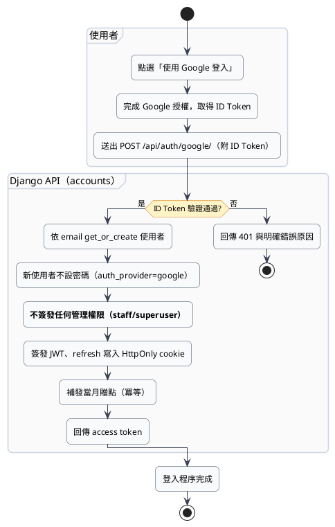

### 1.3 掃描主流程（授權 → SSRF → 預扣 → 爬蟲 → 四維掃描 → 報告）

事實依據：`scans/views.py::ScanJobViewSet.create`、`scans/serializers.py`、`billing/services.py::hold_for_scan`、`scans/scan_plan.py`、`scans/tasks.py::run_scan_job`、`scans/crawler.py`。頁數上界 50、深度預設 3、被動 5 RPS／主動 2 RPS；識別字串 `SiteSense-AI-Scanner/1.0 (authorized-audit)`；Celery 軟限 3300 秒／硬限 3600 秒。

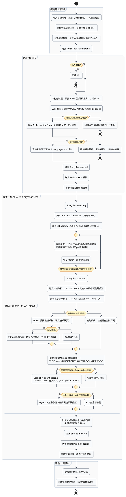

### 1.4 取消與退款

事實依據：`scans/views.py::cancel`（立即改 CANCELLED＋前端端冪等退款）、`scans/cancellation.py`（DB 狀態合作式取消）、`tasks.py` 各階段 `raise_if_cancelled` 檢查點；`refund_full_for_scan` 以淨扣是否為 0 判斷冪等。

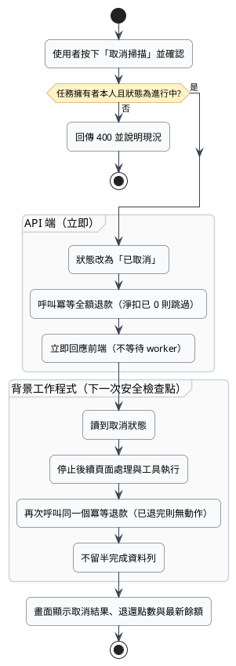

### 1.5 點數結算（settle / refund 冪等）

事實依據：`billing/services.py::settle_scan_actual`（已有 SCAN_REFUND 即跳過；0 元標記交易作冪等信號；total_scans_used 只計一次）、`refund_full_for_scan`（淨扣為 0 回 None）。結算失敗保留掃描結果、記錄待補結算（`tasks.py`）。

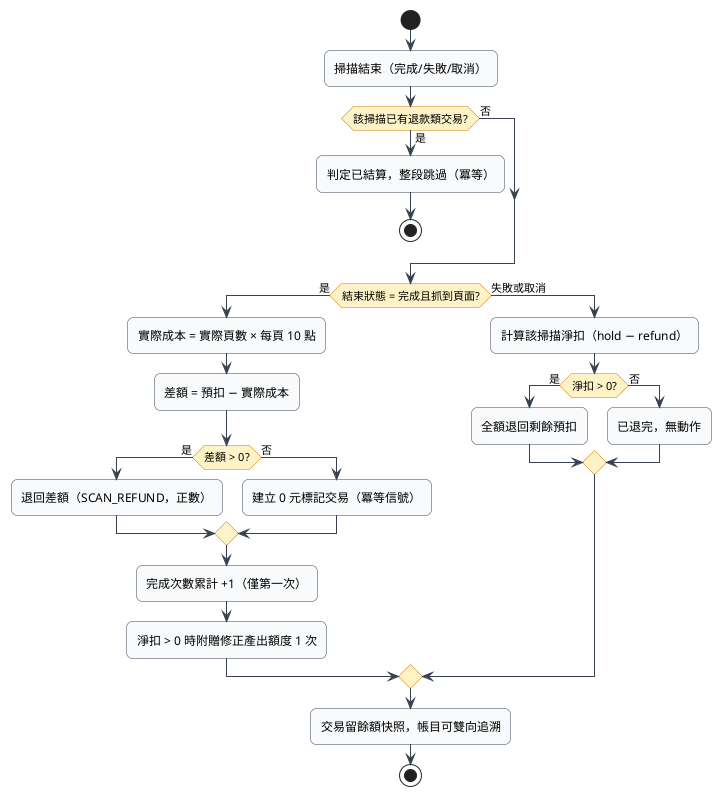

### 1.6 購點結帳（綠界 Stage 測試環境）

事實依據：`billing/views.py::PurchaseView`／`ecpay_callback`、`billing/ecpay.py`（build_checkout_fields／verify_check_mac_value）、`billing/services.py::complete_purchase_order`（冪等）。`ARGUS_PAYMENT_MODE` 僅允許 `disabled`／`ecpay_test`（settings.py:421-423）；Stage 模式強制 payment-stage 結帳網址與 HTTPS 回呼；綠界後台「模擬付款」不入點。

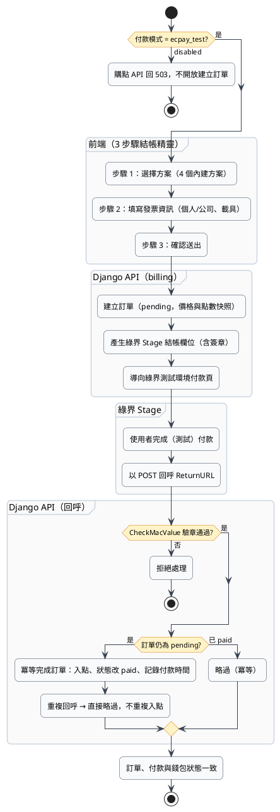

### 1.7 網頁複刻與優化（觸發 → agent 逐輪 → 計費 → 下載）

事實依據：`rebuild/views.py`（create／ask／cost／download）、`rebuild/services.py`（run_rebuild／_run_streaming／ask_followup／_fail）、`rebuild/snapshot.py`（確定性複刻）、`billing/services.py::hold_for_rebuild`／`settle_rebuild_actual`／`charge_rebuild_usage`／`refund_rebuild`、`rebuild/tasks.py`（不重試）。預扣上限 30 點、1 USD = 100 點、最低 1 點；下載 `as_attachment`＋`CSP: default-src 'none'; sandbox`＋`nosniff`。

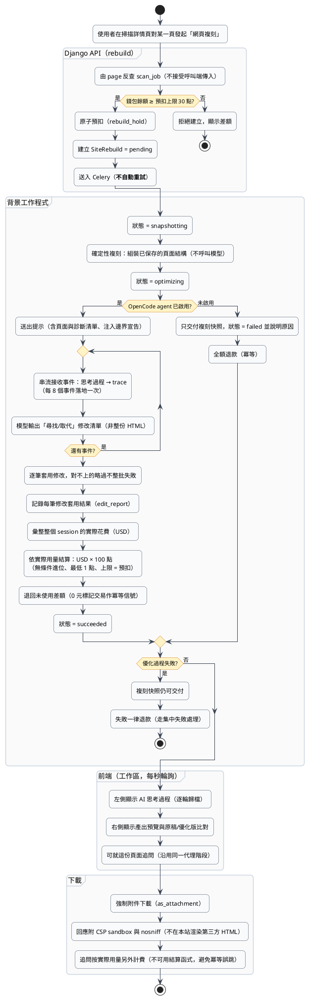

### 1.8 修正產出（觸發 → 額度 → 產物）

事實依據：`scans/fixgen/services.py`（trigger／start／run／_fail）、`fixgen/tasks.py`、`fixgen/policy.py`（三級事實驗證）、`billing/services.py::grant_fixgen_entitlement`／`charge_fixgen_generation`／`refund_fixgen_generation`；API `fix-output/trigger|status|artifacts`（`scans/views.py:336-385`）；額度外固定 30 點。

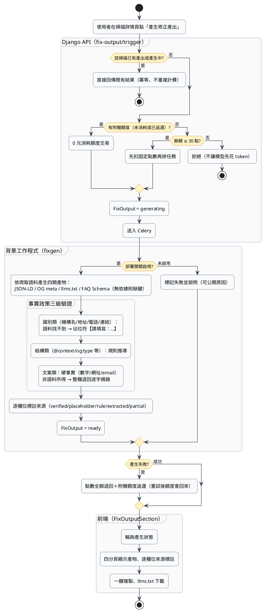

### 1.9 報告產生與防偽查驗

事實依據：`scans/views.py::report`（快取三條件：防偽紀錄存在＋檔案在＋排版本本最新）、`scans/reports.py::build_scan_report`（寫入 ReportVerification）、`scans/verify_views.py::verify_report`（公開、匿名限流、含歷史雜湊比對）；清理排程保留 180 天。

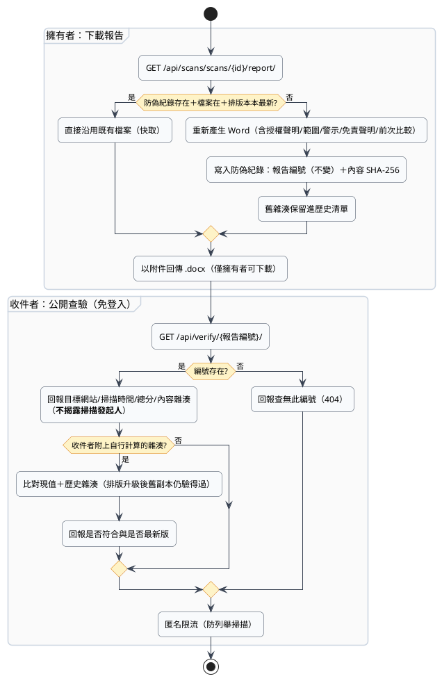

### 1.10 已驗證評論（一人一則＋官方回覆＋按讚檢舉）

事實依據：`reviews/models.py`（PlatformReview 一人一則 OneToOne、ReviewResponse 單一官方回覆、ReviewHelpful／ReviewReport 對評論與回覆分開、ReviewRevision 編修前版本）、`reviews/views.py`。舊版留言串（ReviewMessage，含圖片欄位）僅為舊資料相容保留，公開 API 已不再提供。

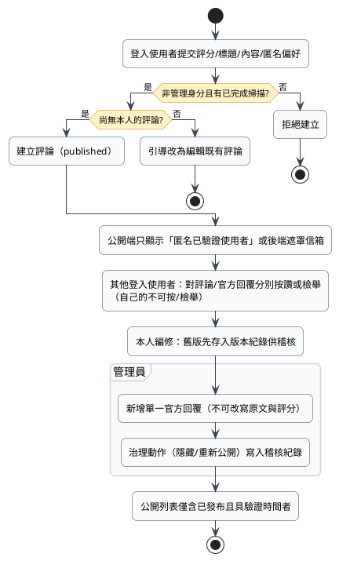

### 1.11 管理後台稽核操作（以點數調整為例）

事實依據：`admin_api/views.py::adjust_coin`、`billing/services.py::admin_adjust`（負值夾到 0 餘額）、`admin_api/models.py::log_admin_action`（失敗不擋業務）。

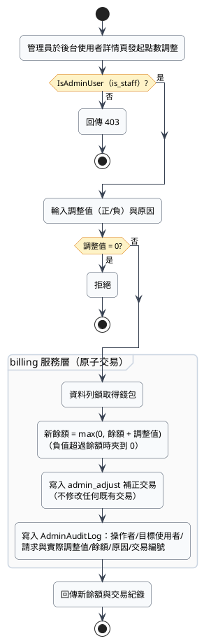

### 1.12 ScanJob 狀態機（依程式碼重寫，取代舊圖 8）

事實依據：`scans/models.py::ScanJob.Status`（七狀態）、`scans/tasks.py`（狀態只在任務入口模組推進；completed 以條件式 update 防止覆蓋取消）。**注意：舊版 PlantUML.md 圖 7-4-1 中的 Draft／Validating／finalizing 等狀態在程式碼中不存在，以本圖為準。**

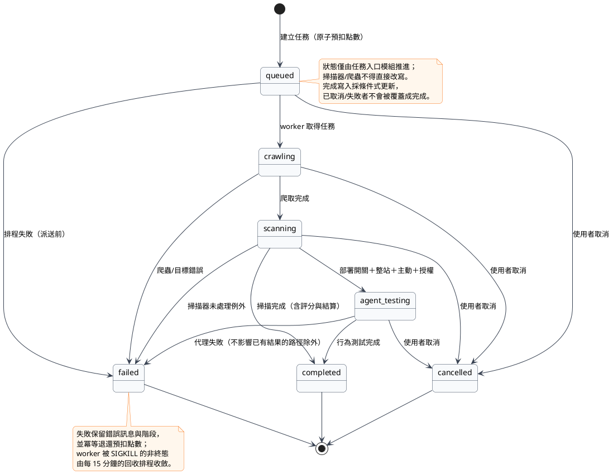

### 1.13 掃描資料流（依現行程式碼重寫，取代舊圖 7）

事實依據：同 1.3；此為系統手冊「掃描資料流」圖的現況版（新增深度被動資安層、WAF 說明、修正產出額度附贈）。

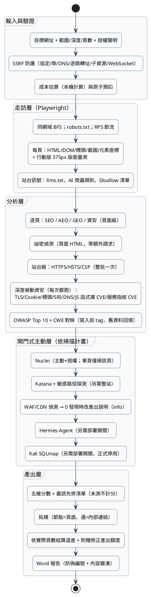

---

## 二、循序圖（PlantUML 原始碼）

### 2.1 掃描主流程（使用者 → 前端 → API → Redis → worker → DB）

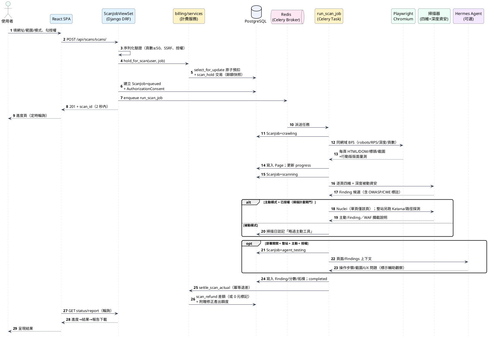

### 2.2 購點結帳（綠界 Stage 三步驟）

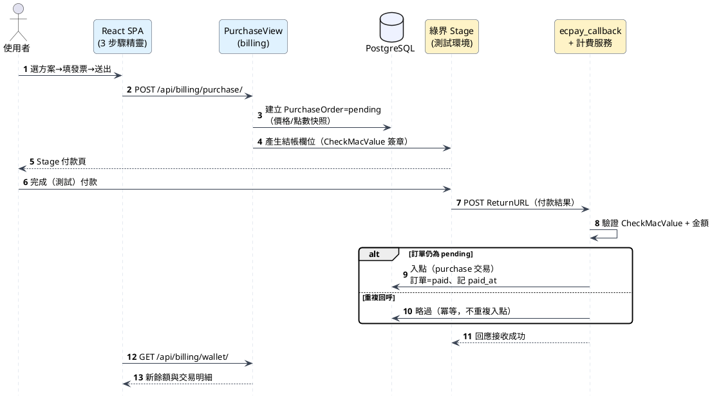

### 2.3 網頁複刻（觸發 → 串流 → 結算 → 下載）

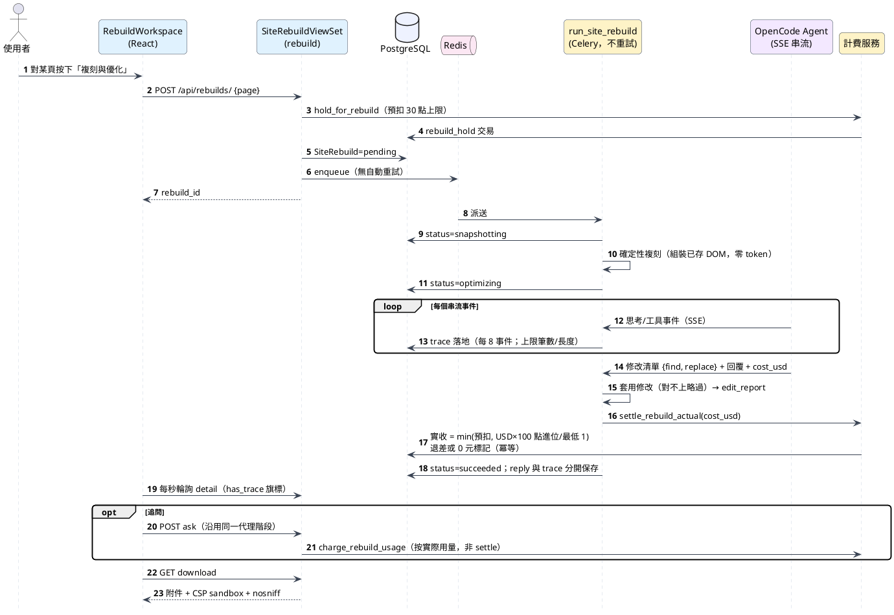

### 2.4 報告防偽查驗（第三方收件者）

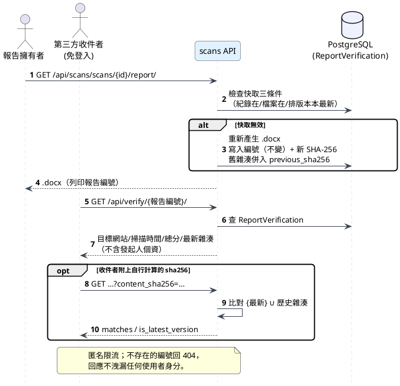

---

## 三、ER 圖與資料表清單

掃描範圍：`backend/apps/*/models.py` 全部 model（2026-09-19 查證）。9 個 Django app 中 7 個擁有 model，共 **33 張資料表**（`insights`、`agent` 無自有 model；`agent` 的執行紀錄放在 `scans` 的 AgentSession／AgentStep；2026-09-19 新增 LoginEvent／SubscriptionPlan／UserSubscription／VerifiedDomain）。

### 3.1 ER 圖（PlantUML entity 語法）

```plantuml
@startuml
skinparam defaultFontName Microsoft JhengHei
skinparam shadowing false
skinparam linetype ortho
skinparam roundcorner 8
skinparam BackgroundColor #FFFFFF
skinparam EntityBorderColor #334155
skinparam EntityBackgroundColor #F8FAFC
skinparam ArrowColor #374151

package "accounts" #E0F2FE {
  entity "User" as user {
    * id : bigint <<PK>>
    --
    username (=email) : varchar
    password : hashed
    is_staff / is_superuser : bool
    first_name / last_name
    date_joined
  }
  entity "PasswordResetToken" as prt {
    * id : bigint <<PK>>
    --
    user_id <<FK>>
    token_hash (HMAC digest)
    expires_at / used_at
  }
  entity "LoginEvent" as loginevent {
    * id : bigint <<PK>>
    --
    user_id <<FK>>
    method : password/google/register
    ip_address / user_agent
    created_at
  }
}

package "scans" #ECFDF5 {
  entity "ScanJob" as scanjob {
    * id : bigint <<PK>>
    --
    user_id <<FK>>
    original_url / normalized_url / origin
    status : queued/crawling/scanning/\nagent_testing/completed/failed/cancelled
    scan_mode : passive/active
    max_depth(3) / max_pages(50) / respect_robots
    active_testing_authorized : bool
    overall_score / category_scores(JSON)\ntop_actions(JSON)
    progress(JSON) / scan_log(JSON)
    warning_summary(JSON) / error_message
    created_at / started_at / completed_at
  }
  entity "AuthorizationConsent" as consent {
    * id : bigint <<PK>>
    --
    scan_job_id <<FK, OneToOne>>
    user_id <<FK>>
    ip_address / user_agent
    authorized_domain / statement(全文)
    active_testing_authorized / created_at
  }
  entity "VerifiedDomain" as vdomain {
    * id : bigint <<PK>>
    --
    user_id <<FK>>
    domain <<unique(user,domain)>>
    status : pending/verified/rejected/expired
    method : dns_txt/meta_tag/html_file
    token（每網域獨立）
    verified_at / expires_at(90天TTL)
    admin_override / admin_actor / admin_note
    last_checked_at / last_error
  }
  entity "Page" as page {
    * id : bigint <<PK>>
    --
    scan_job_id <<FK>>
    url / final_url / origin
    status_code / title / depth
    html / rendered_dom / html_only_text
    screenshot_path / load_time_ms
    fetch_mode : live/cache_replay
    blocked_reason / outgoing_links(JSON)
    headers(JSON) / element_boxes(JSON)
    layout_metrics(JSON)（行動版 375px）
    <<unique>> (scan_job, url)
  }
  entity "Finding" as finding {
    * id : bigint <<PK>>
    --
    scan_job_id <<FK>> / page_id <<FK, nullable>>
    category : seo/aeo/geo/security/ux
    severity : critical/high/medium/low/info
    priority_score / confidence
    title / description / remediation
    evidence / evidence_json / evidence_type
    rule_id / selector / bounding_box(JSON)
    owasp_category(A01~A10) / cwe_id
    ai_explanation / ai_remediation
    ai_handoff_prompt / created_at
  }
  entity "ReportVerification" as rv {
    * id : bigint <<PK>>
    --
    scan_job_id <<FK, OneToOne>>
    report_number <<unique>>
    content_sha256 / previous_sha256(JSON)
    renderer_version / generated_at
  }
  entity "AgentSession" as asess {
    * id : bigint <<PK>>
    --
    scan_job_id <<FK>>
    provider / model / status
    max_steps(20) / total_tokens
    started_at / completed_at
  }
  entity "AgentStep" as astep {
    * id : bigint <<PK>>
    --
    session_id <<FK>>
    step_number / observation
    thought_summary / tool_name
    tool_arguments(JSON) / tool_result(JSON)
    <<unique>> (session, step_number)
  }
  entity "FixOutput" as fo {
    * id : bigint <<PK>>
    --
    scan_job_id <<FK, OneToOne>>
    status : idle/generating/ready/failed
    artifacts(JSON)：json_ld/og_meta/\nllms_txt/faq_schema＋逐欄位來源標註
    provider / model_id / total_tokens
    error(僅可公開訊息) / generated_at
  }
}

package "billing" #FEF3C7 {
  entity "CoinWallet" as wallet {
    * id : bigint <<PK>>
    --
    user_id <<FK, OneToOne>>
    balance / total_purchased_ntd
    total_scans_used
    last_bonus_year / last_bonus_month（月贈冪等）
  }
  entity "PricingPlan" as plan {
    * id : bigint <<PK>>
    --
    code <<unique>> / name
    price_ntd / coin_amount / badge
    sort_order / is_active
  }
  entity "SubscriptionPlan" as subplan {
    * id : bigint <<PK>>
    --
    code <<unique>> / name
    monthly_price_ntd / monthly_coins
    features(JSON) / badge
    sort_order / is_active
  }
  entity "UserSubscription" as usersub {
    * id : bigint <<PK>>
    --
    user_id <<FK, OneToOne>>
    plan_id <<FK, PROTECT>>
    status : active/cancelled/expired
    periods_remaining / current_period_end
    last_grant_period（"YYYY-MM" 冪等）
    source : admin_grant/ecpay_test
    cancelled_at
  }
  entity "PurchaseOrder" as order {
    * id : bigint <<PK>>
    --
    user_id <<FK>> / plan_id <<FK>>
    price_ntd / coin_amount（下單快照）
    buyer_name / buyer_email
    invoice_type / company_name / tax_id
    carrier_type / carrier_id
    status : pending/paid/cancelled
    transaction_id <<FK, nullable>>
    paid_at / created_at
  }
  entity "CoinTransaction" as tx {
    * id : bigint <<PK>>
    --
    wallet_id <<FK>>
    amount（正=入帳/負=扣款）
    kind : monthly_bonus/purchase/scan_hold/\nscan_refund/admin_adjust/rebuild_hold/\nrebuild_refund/fixgen_grant/charge/refund/\nsubscription_grant
    balance_after（餘額快照）
    scan_job_id / plan_id / site_rebuild_id\n/admin_actor_id（皆 nullable FK）
    note / created_at
  }
}

package "rebuild" #F3E8FF {
  entity "SiteRebuild" as rebuild {
    * id : bigint <<PK>>
    --
    scan_job_id <<FK>> / page_id <<FK>>
    status : pending/snapshotting/\noptimizing/asking/succeeded/failed
    snapshot_path / optimized_path
    opencode_session_id
    trace(JSON，上限) / reply
    conversation(JSON，逐輪歸檔)
    edit_report(JSON，逐筆套用結果)
    model_id / cost_usd / coins_charged
    error(僅可公開訊息)
  }
}

package "reviews" #FCE7F3 {
  entity "PlatformReview" as review {
    * id : bigint <<PK>>
    --
    user_id <<FK, OneToOne（一人一則）>>
    rating(1-5) / title / comment
    show_partial_email / status
    experience_at（完成掃描時間）
    is_featured / created_at
  }
  entity "ReviewHelpful" as rhelp {
    * id <<PK>> / review_id <<FK>> / user_id <<FK>>
    <<unique>> (review, user)
  }
  entity "ReviewResponse" as rresp {
    * id : bigint <<PK>>
    --
    review_id <<FK, OneToOne（單一官方回覆）>>
    author_id <<FK>> / body
    created_at / updated_at
  }
  entity "ReviewResponseHelpful" as rrh {
    * id <<PK>> / response_id <<FK>> / user_id <<FK>>
  }
  entity "ReviewRevision" as rrev {
    * id <<PK>> / review_id <<FK>>
    舊 rating/title/comment（編修前快照）
  }
  entity "ReviewReport" as rrep {
    * id <<PK>> / review_id / response_id <<FK>>
    reporter_id / reason / status
    resolved_by / resolved_at
  }
  entity "ReviewMessage\n(僅舊資料相容)" as rmsg {
    * id <<PK>> / review_id / author_id <<FK>>
    is_admin / body / image(舊功能) / created_at
  }
  entity "ReviewMessageHelpful\n(僅舊資料相容)" as rmh {
    * id <<PK>> / message_id / user_id <<FK>>
  }
}

package "admin_api / content" #EEF2FF {
  entity "AdminAuditLog" as audit {
    * id : bigint <<PK>>
    --
    admin_actor_id <<FK>> / target_user_id <<FK, nullable>>
    action : coin_adjust/review_reply/\nreview_moderate/review_delete/\nuser_toggle_staff/other
    target_object_repr / payload(JSON)
    created_at
  }
  entity "Announcement" as ann {
    * id : bigint <<PK>>
    --
    title / content
    type : permanent/temporary
    active_days / is_active / created_at
  }
  entity "ProjectFeature" as feat {
    title / icon / description\nsort_order / is_active
  }
  entity "TeamMember" as team {
    name / role / bio / skills(JSON)\nskill_levels(JSON) / contributions(JSON)
    avatar_emoji / avatar_url / email / github_url
    sort_order / is_active
  }
  entity "ProjectMilestone" as mile {
    title / date / description\nicon / sort_order / is_active
  }
  entity "AppRelease" as rel {
    version / platform(pwa/android/ios/desktop)
    release_notes / download_url / icon_url
    is_active / is_latest / released_at
  }
}

user ||--o{ scanjob : 建立
user ||--|| wallet : 對應
user ||--o{ order : 下單
user ||--o| review : 一人一則
user ||--o{ prt : 密碼重設

scanjob ||--|| consent : 授權
scanjob ||--o{ page : 走訪
scanjob ||--o{ finding : 產出
scanjob ||--|| rv : 防偽
scanjob ||--o{ asess : 代理執行
asess ||--o{ astep : 步驟
scanjob ||--o| fo : 修正產出
scanjob ||--o{ rebuild : 複刻
page ||--o{ finding : 頁面證據
page ||--o{ rebuild : 以頁為單位

wallet ||--o{ tx : 交易
scanjob ||--o{ tx : 計費關聯
rebuild ||--o{ tx : 逐次複刻計費
plan ||--o{ order : 方案

review ||--o| rresp : 官方回覆
review ||--o{ rhelp : 按讚
review ||--o{ rrev : 編修歷史
review ||--o{ rrep : 檢舉
rresp ||--o{ rrh : 回覆按讚
rresp ||--o{ rrep : 回覆檢舉
review ||--o{ rmsg : 舊留言串

user ||--o{ audit : 稽核操作
@enduml
```

### 3.2 資料表清單（依 app）

| App | 資料表 | 重點欄位 / 關聯 | 用途 |
|---|---|---|---|
| accounts | User | 繼承 AbstractUser；username=email；is_staff／is_superuser | 唯一帳號模型 |
| accounts | PasswordResetToken | HMAC digest、單次、預設 60 分鐘 | 密碼重設（原始 token 不落地） |
| accounts | LoginEvent | method（password/google/register）、ip、user_agent、created_at | 登入活動記錄（admin 時間軸調查用） |
| scans | ScanJob | 七狀態、passive/active、max_pages≤50、max_depth 預設 3、progress／scan_log(JSON) | 掃描任務主表 |
| scans | AuthorizationConsent | OneToOne ScanJob；聲明全文、IP、UA、網域 | 掃描授權落地（法律證據） |
| scans | VerifiedDomain | status、method（dns_txt/meta_tag/html_file）、token、expires_at 90 天 TTL、admin_override | 網域所有權驗證（主動測試閘門） |
| scans | Page | html／rendered_dom／screenshot_path／element_boxes／layout_metrics（375px） | 頁面證據；unique(scan_job,url) |
| scans | Finding | category／severity／rule_id／evidence_json／selector／bounding_box／owasp／cwe／ai_handoff_prompt | 問題紀錄 |
| scans | ReportVerification | report_number(unique)、content_sha256、previous_sha256、renderer_version | 報告防偽 |
| scans | AgentSession / AgentStep | provider／model／tokens；步驟含 thought／tool 呼叫 | Hermes 代理執行紀錄 |
| scans | FixOutput | OneToOne ScanJob；artifacts 四類＋逐欄位來源標註 | 修正產出 |
| billing | CoinWallet | balance、total_purchased_ntd、total_scans_used、last_bonus_year/month | 點數錢包（唯一寫入入口=services） |
| billing | PricingPlan | 4 個 seed 方案（見成本節） | 購點方案 |
| billing | SubscriptionPlan | monthly_price_ntd／monthly_coins、features(JSON)；seed：199/300、499/900、999/2000 | 訂閱方案 |
| billing | UserSubscription | user OneToOne、periods_remaining、current_period_end、last_grant_period 冪等、source | 訂閱狀態（惰性冪等結算） |
| billing | PurchaseOrder | 價格快照、發票欄位、status、transaction FK | 購點訂單 |
| billing | CoinTransaction | 11 種 kind、amount、balance_after、scan_job／plan／site_rebuild／admin_actor FK | 不可竄改帳務 |
| rebuild | SiteRebuild | 兩路徑（snapshot/optimized）、trace／reply／conversation、edit_report、cost_usd | 網頁複刻與優化 |
| reviews | PlatformReview | OneToOne user、rating 1-5、experience_at、status | 一人一則已驗證評論 |
| reviews | ReviewResponse | OneToOne review | 單一官方回覆 |
| reviews | ReviewHelpful／ReviewResponseHelpful | per-user 唯一 | 評論／回覆分開按讚 |
| reviews | ReviewReport | review／response 各自 FK、status、resolved_by | 檢舉與結案 |
| reviews | ReviewRevision | 編修前快照 | 稽核 |
| reviews | ReviewMessage／ReviewMessageHelpful | 含 image 欄位 | **僅舊資料相容**，公開 API 已移除 |
| admin_api | AdminAuditLog | action 7 種、payload(JSON) | 不可刪除稽核 |
| admin_api | Announcement | permanent／temporary、active_days | 平台公告（superuser 管理） |
| content | ProjectFeature／TeamMember／ProjectMilestone／AppRelease | sort_order／is_active | 公開 CMS（讀取走 content、寫入走 admin_api/cms） |

---

## 四、部署架構圖（K8s / GitOps 現況）

事實依據：`k8s/README.md`、`k8s/01-namespace-config.yaml`～`11-kali-admission.yaml`、`k8s/kustomization.yaml`。架構：PVE 自架 k8s（1 master + 2 worker）；正式公開網域 `xn--gst.tw` 與 `argus.clouda.dpdns.org`（cloudflared 為 GitOps 之外的服務層）。

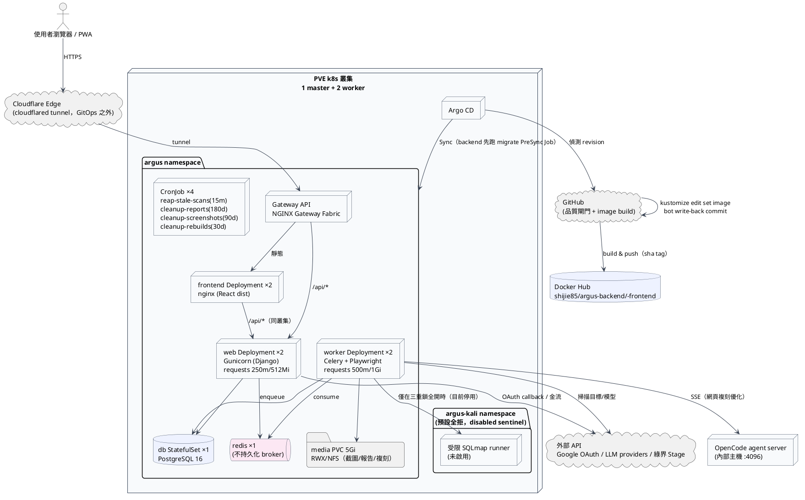

部署要點（皆為 manifest 查證事實）：

- **副本與資源**：web ×2（requests 250m CPU／512Mi；limits 1 CPU／1Gi）、worker ×2（requests 500m／1Gi；limits 2 CPU／3Gi，Playwright 吃記憶體）、frontend ×2（未設 resources，如實記載）、PostgreSQL 16 StatefulSet ×1（PVC 5Gi）、redis 7 ×1（與 Compose 一致不做持久化）、media PVC 5Gi RWX NFS。
- **GitOps 鏈**：push → 品質閘門（backend／frontend／文字追蹤／Kustomize）→ image build/push → `kustomize edit set image` → bot 寫回 `k8s/kustomization.yaml` → Argo CD Sync（backend 先執行 migrate PreSync Job，須 `Completed / 0`）。
- **維護排程**：`reap-stale-scans` 每 15 分鐘回收被中斷掃描並退款；三支 cleanup 每日跑（報告 180 天／截圖 90 天／複刻 30 天），必須掛 media PVC。
- **網路邊界**：NetworkPolicy 白名單（frontend→web:8000 與 CoreDNS；web/worker→PG/Redis/CoreDNS＋公網 IPv4/IPv6 80/443/587，排除私網/metadata；PG/Redis 不得主動 egress）。
- **Kali 攻擊鏈**：軟體已完成但正式叢集 disabled（`ARGUS_KALI_ENABLED=false`、sentinel digest），啟用屬手動控制平面 gate。

---

## 五、成本效益分析

> 本節數字分兩類：**「事實」**來自程式碼／manifest／實測 log；**「假設」**為市場價格或外推估算，已逐一標註。示範用途，正式投資決策前應重新驗證假設值。

### 5.1 基礎設施成本表

| 項目 | 內容 | 月成本（新台幣） | 性質 |
|---|---|---|---|
| 運算節點 | PVE 自架 3 節點（1 master + 2 worker），現有校園／私人硬體 | **假設** 1,500–3,000（硬體折舊攤提；實際邊際成本近 0） | 假設 |
| 網域 | 主網域 `xn--gst.tw`（.tw）；`argus.clouda.dpdns.org` 為免費子網域 | **假設** 70–100（年費 800–1,200 攤提） | 假設 |
| 對外通道 | cloudflared tunnel（Cloudflare Free 方案） | 0（**假設**維持免費額度內） | 假設 |
| TLS 憑證 | Cloudflare 邊緣／叢集入口，未自購 | 0 | 事實 |
| GitOps / CI | GitHub Actions（public repo 免費額度）、Argo CD（自架於叢集內） | 0（**假設**不超額） | 假設 |
| 映像檔 hosting | Docker Hub 免費額度（backend／frontend 二 image） | 0（**假設**不超額） | 假設 |
| 資料庫／快取儲存 | postgres PVC 5Gi + media PVC 5Gi（NFS） | 0（自架 NFS，含於節點成本） | 事實（容量）；成本為假設 |
| OpenCode agent 伺服器 | 內部主機（172.16.2.126:4096），僅複刻優化時使用 | **假設** 含於既有硬體 | 假設 |

資源需求盤點（事實，來自 `k8s/04-backend.yaml`／`03-data.yaml`）：

| 工作負載 | 副本 | requests | limits |
|---|---|---|---|
| web（Gunicorn） | 2 | 250m CPU／512Mi | 1 CPU／1Gi |
| worker（Celery＋Playwright） | 2 | 500m CPU／1Gi | 2 CPU／3Gi |
| frontend（nginx） | 2 | 未設定 | 未設定 |
| 維護 CronJob ×4 | 每日／15 分 | 50m／128Mi | 500m／512Mi |
| PostgreSQL 16 | 1 | —（StatefulSet 未設 CPU/limit，PVC 5Gi） | — |
| Redis 7 | 1 | — | —（不持久化） |

叢集最低資源需求（requests 合計）：約 1.75 CPU／3.25 GiB——3 台一般迷你主機即可承載（**假設**）。

### 5.2 每掃描成本估算

**被動模式（預設）**：

- 參數（事實）：max_pages=50、RPS=5、深度 3、Celery 軟限 55 分／硬限 60 分。
- 實測基準（事實）：正式站 scan 26——10 頁被動掃描全程約 **2.5 分鐘**（log/2026-08-29_production-scan-smoke-test.md），44 筆 findings，結算正確。
- 外推（**假設**）：50 頁約 10–13 分鐘 worker 佔用（線性外推＋深度被動資安掃描數十秒）。
- 換算（**假設**）：以 worker requests 0.5 CPU／1Gi、雲端 VM 市價約 1 vCPU+2GB ≈ NT$450/月（≈NT$0.01/分鐘/vCPU）計，單次滿頁被動掃描計算成本約 **NT$0.05–0.15**；加計截圖與報告的 5Gi 共用儲存後仍 **遠低於 NT$1**。

**主動模式**：

- 參數（事實）：RPS=2（頁面下限時間即倍增），另跑 Nuclei／Katana／路徑探測（共用同一 2 RPS 預算）。
- 外推（**假設**）：約為被動的 2–4 倍 worker 時間，單次成本仍 **< NT$1**。

**AI 功能變動成本（事實與實測）**：

| 功能 | 成本性質 | 依據 |
|---|---|---|
| Hermes-Agent 行為測試 | token（上限 20 步／60k token） | settings 預設關閉避免每次掃描消耗 |
| 網頁複刻優化 | 依 agent 回報 USD 用量計費（1 USD=100 點） | 實測 84KB 頁面改為修改清單後 35 秒、USD 0.052→**0.019**（rebuild/CLAUDE.md） |
| 修正產出 | 固定 30 點／次（額度外） | billing services |
| 複刻（純快照） | **零 token** | 確定性組裝，不呼叫模型 |

結論：單次掃描的基礎設施成本可忽略，**真正的變動成本是 AI 功能**；系統的設計（修改清單取代整份 HTML、按實際用量結算、預設關閉）正是把這條曲線壓下來的手段。

### 5.3 點數經濟

定價事實（`billing/migrations/0002_seed_plans_and_wallets.py`）：

| 方案 | 價格 | 點數 | 折合單價 | 徽章 |
|---|---|---|---|---|
| 入門 starter | NT$100 | 100 點 | 1.00 NT$/點 | — |
| 標準 standard | NT$450 | 500 點 | 0.90 NT$/點 | -10% |
| 進階 advanced | NT$800 | 1,000 點 | 0.80 NT$/點 | -20% |
| 旗艦 flagship | NT$1500 | 2,200 點 | 0.68 NT$/點 | -32% |

- 每頁 10 點（事實）：滿頁被動掃描（50 頁）= 500 點 = 入門價 NT$500／旗艦價 NT$341。
- 月贈 200 點（事實）= 每月免費 20 頁，足以讓小型站每月做一次單頁×20 或兩次小範圍健檢——**免費層的設計目的就是讓「定期回來看一次」不用付錢**。
- 毛利結構：基礎設施成本每掃描 <NT$1，對 NT$341–500 的滿頁掃描報價，基礎毛利率 >99%（**假設**：不計 AI 用量與人事）；AI 功能以點數實報實銷（rebuild 依 USD 用量換算），模型成本直接轉嫁、不侵蝕基礎毛利。
- 損益平衡（**假設**演示）：固定成本取 NT$2,000/月（節點攤提 NT$1,500＋網域與雜項 NT$500），則：
  - 需月營收 NT$2,000 ≈ 旗艦方案 1.4 張，或標準方案 4.5 張；
  - 以「5% 月活轉付費、付費者月均 NT$300」估，需約 **135 位月活躍使用者**；
  - 對照每月免費 200 點的贈點成本（每用戶最多 20 頁掃描 ≈ 基礎成本 <NT$0.3），免費層幾乎不構成成本壓力。

### 5.4 訂閱定價建議（輕量訂閱，規劃中、尚未上線）

設計原則（**建議**，功能尚未上線）：「輕量訂閱制」不做週期扣款，以「月費 → 每月贈點」兌換，搭配到期邊界補發與同月冪等，把金流風險與開發成本壓到最低。建議方案如下：

| 訂閱方案 | 月費（建議） | 每月贈點（建議） | 折合單價 | 定位 |
|---|---|---|---|---|
| 輕量 sub-lite | NT$199 | 300 點 | 0.66 NT$/點 | 單一小網站定期檢查（30 頁/月） |
| 專業 sub-pro | NT$499 | 900 點 | 0.55 NT$/點 | 中型網站或多站巡檢（90 頁/月） |
| 團隊 sub-team | NT$999 | 2,000 點 | 0.50 NT$/點 | 團隊與多客戶（200 頁/月） |

定價理由：

1. **單調折扣階梯**：1.00（單買）→ 0.66 → 0.55 → 0.50，訂閱比最便宜單買方案便宜至少 34%，以折扣換留存與現金流可預測性。
2. **錨定月贈 200 點**：訂閱門檻（NT$199）必須明顯優於「不付費只用 200 點」，又不能低到失去意義——300 點＝免費層 1.5 倍，是可感知的第一級升級。
3. **頁數對齊使用情境**：300/900/2,000 點＝30/90/200 頁，分別對應「每月一次小站健檢」「每週一次單頁追蹤」「多客戶月報」，數字可直接在行銷文案中換算。
4. **無週期扣款（輕量制）**：不串自動扣款，以「預付期數＋到期邊界 lazy 補發＋同月冪等」實現，金流風險與開發成本最低，適合競賽階段上線。

### 5.5 商業模式圖（BMC 九宮格）

| 區塊 | 內容 |
|---|---|
| **客層（Customer Segments）** | (1) 無工程師的小型網站經營者（電商、工作室）；(2) 內容與行銷人員（在乎搜尋與 AI 引用）；(3) 接案工程師／顧問（要一份能交付客戶的報告）；(4) 多站管理者（定期巡檢）。 |
| **價值主張（Value Propositions）** | 一個網址同時得到 SEO／AEO／GEO／資安／UX 五維診斷；每個問題附證據與位置、排出修補優先序；報告具防偽編號可對外背書；進一步提供可直接貼上的修正產出與 AI 頁面優化——從「知道問題」到「動手改善」一條龍。免費工具＋每月 200 點讓零成本開始。 |
| **通路（Channels）** | 公開網站（PWA 可安裝）、免費工具頁導流、已驗證評論（社交證明）、Word 報告轉寄（防偽查驗頁帶回流量）。 |
| **客戶關係（Customer Relationships） | 自助服務為主；報告即交付物；修正產出逐欄位標示「查證過／請人工確認」建立信任；管理端官方回覆與評論治理維持社群品質。 |
| **收益流（Revenue Streams）** | (1) 一次性購點（4 方案，0.68–1.00 NT$/點）；(2) 輕量訂閱（規劃中：199/499/999 月費→每月贈點）；(3) AI 加值按量計費（複刻優化依 USD 實報實銷、修正產出定額）。 |
| **關鍵資源（Key Resources）** | 掃描引擎（Playwright＋四維規則＋深度資安層）、本地 CVE 資料庫（Retire.js＋NVD）、AI 代理鏈（Hermes＋OpenCode）、點數帳務核心（單一寫入入口＋冪等）、K8s/GitOps 部署基盤。 |
| **關鍵活動（Key Activities）** | 規則庫與 CVE 資料庫維護、掃描品質與誤報率控管、AI 成本治理（預設關閉／限額／事實驗證）、資安邊界維護（授權閘門／SSRF／網路政策）。 |
| **關鍵夥伴（Key Partnerships）** | Google（OAuth）、LLM 供應商（MiniMax／GLM／Gemini）、綠界（金流）、開源社群（Playwright／Nuclei／Katana／Retire.js／SQLmap／NVD）。 |
| **成本結構（Cost Structure）** | 固定：自架叢集攤提＋網域（假設 NT$2,000/月級）。變動：AI token（已以計費設計轉嫁）、每掃描基礎成本（<NT$1，可忽略）。主要策略成本為規則庫與 CVE 更新的維運人力。 |

---

## 六、管理後台權限矩陣

事實依據：`admin_api/urls.py`＋`views.py`（逐一核對 decorator）＋`cms_views.py`（`_AuditedModelViewSet.permission_classes=[IsAdminUser]`）＋`permissions.py::IsSuperuser`。三層：一般使用者（IsAuthenticated）／一般管理員（IsAdminUser＝is_staff）／超級管理員（IsSuperuser）。

| 端點 | 方法 | 一般使用者 | 一般管理員（staff） | 超級管理員 |
|---|---|---|---|---|
| `/api/admin/me/` | GET | ✅（回後台身分識別） | ✅ | ✅ |
| `/api/admin/overview/` | GET | 403 | ✅ | ✅ |
| `/api/admin/dashboard/` | GET | 403 | ✅ | ✅ |
| `/api/admin/users/` | GET | 403 | ✅ | ✅ |
| `/api/admin/users/{id}/` | GET | 403 | ✅ | ✅ |
| `/api/admin/users/{id}/adjust-coin/` | POST | 403 | ✅ | ✅ |
| `/api/admin/transactions/` | GET | 403 | ✅ | ✅ |
| `/api/admin/reviews/` | GET | 403 | ✅ | ✅ |
| `/api/admin/reviews/{id}/reply/` | POST／DELETE | 403 | ✅ | ✅ |
| `/api/admin/reviews/{id}/moderate/` | PATCH | 403 | ✅ | ✅ |
| `/api/admin/scans/` | GET | 403 | ✅ | ✅ |
| `/api/admin/scans/{id}/` | GET | 403 | ✅ | ✅ |
| `/api/admin/orders/` | GET | 403 | ✅ | ✅ |
| `/api/admin/settings/` | GET | 403 | ✅ | ✅ |
| `/api/admin/audit-log/` | GET | 403 | **403** | ✅ |
| `/api/admin/announcements/active/` | GET | ✅（目前生效公告，唯讀） | ✅ | ✅ |
| `/api/admin/announcements/` | GET／POST | 403 | **403** | ✅ |
| `/api/admin/announcements/{pk}/` | GET／PATCH／DELETE | 403 | **403** | ✅ |
| `/api/admin/cms/features/` 等 5 組（features／team／releases／plans／milestones） | CRUD | 403 | ✅（寫入記稽核） | ✅ |

對應前端頁面（`App.jsx` 查證，共 12 頁＋1 轉址）：overview、users、users/:userId、transactions、reviews、scans、scans/:scanId、content、plans、settings、audit-log、announcements（`/admin` 轉址至 overview）。訂單資料目前呈現於總覽統計卡（訂單數／本月／已付），無獨立訂單頁。

staff／superuser 身分僅能由管理指令（`seed_admin`）或 shell 授予，任何認證端點不簽發（accounts/CLAUDE.md 禁止事項）。

---

## 七、稽核與日誌設計

設計原則：**每個高風險動作都有「誰、何時、對誰、做了什麼、依據什麼」五要素的落地紀錄；紀錄不可刪改；寫入失敗不阻擋業務但有邊界**。

### 7.1 AuthorizationConsent（掃描授權落地）

- 位置：`scans/models.py::AuthorizationConsent`，與 ScanJob 一對一。
- 內容：授權聲明**全文**、授權網域、來源 IP、瀏覽器識別字串、是否含主動測試授權、時間。
- 設計意圖：法務爭議時能重現「使用者當時同意了什麼」；主動測試的額外授權單獨記欄位，與被動授權分開。

### 7.2 AdminAuditLog（管理操作稽核）

- 位置：`admin_api/models.py`；寫入一律走 `log_admin_action()` 集中入口，**寫入失敗只記 log、不擋業務**（避免稽核故障拖垮管理操作，代價是極低機率漏記，由 superuser 日誌頁覆核）。
- 內容：操作者、目標使用者、動作（點數調整／回覆評論／審核評論／刪除評論／切換管理身分／其他）、目標描述、結構化 payload（如調整前後餘額、交易編號）。
- 規則：**禁止刪除，僅可查詢**（root AGENTS.md 禁止事項）；查詢權限僅 superuser。

### 7.3 scan_log（掃描執行日誌）

- 位置：`ScanJob.scan_log`（JSON 陣列），每筆 `{t, lvl: info/warn/error, msg}`。
- 內容：任務啟動（遮罩後目標）、逐頁進度（URL／HTTP 狀態／問題數）、工具決策（「被動模式：略過 Nuclei」「單頁範圍：略過整站探測」）、WAF 偵測、失敗與退款原因。
- 遮罩：URL query 值與個資在落地前經 `redact_url_query_values`／`redact_pii_in_text`；Kali 決策日誌只記固定結構化原因，**嚴禁拼接 URL／query／原始輸出**。
- 對外：使用者可在進度頁看到；支援依任務 ID 重建完整時間線（NF-014）。

> 附註：登入事件紀錄（LoginEvent）與訂閱相關模型屬**規劃中功能**（尚未納入已提交程式碼），本檔依「既有事實」原則暫不展開，待功能落地後再補入本節。

---

## 八、深度資安能力清單（W3c）

> 本節回答評審常見問題：「沒有後端原始碼，你怎麼掃出資安問題？」
> 答案＝**三層證據鏈**：(1) 被動指紋層——伺服器／函式庫／設定面會自己暴露版本與配置；(2) CVE 反推層——指紋對本地漏洞資料庫；(3) 閘門式主動驗證層——使用者明確授權後才發探測請求。全程不接觸原始碼、不執行破壞性操作，判斷不了就標「無法確定」。

### 8.1 被動層（每次掃描都跑；零攻擊流量）

| 掃描器 | 檢查內容 | 來源檔案（security/） |
|---|---|---|
| ssl_scanner | TLS 憑證到期（≤30 天 HIGH／≤7 天 CRITICAL）、TLS<1.2、弱 cipher（RC4/DES/3DES） | ssl_scanner.py |
| cookie_scanner | Secure／HttpOnly／SameSite 旗標 | cookie_scanner.py |
| header_scanner | 資訊洩漏、CORS 寬鬆度、CSP 品質 | header_scanner.py |
| sri_scanner | 跨來源 script/link 缺 integrity（子資源完整性） | sri_scanner.py |
| dns_scanner | SPF／DMARC／DNSSEC（不做 DKIM：黑盒無法列舉 selector） | dns_scanner.py |
| js_library_scanner | 前端 JS 函式庫版本 → **Retire.js 離線規則庫**比對已知漏洞（零額外 HTTP、零新套件） | js_library_scanner.py |
| service_cve_scanner | Server／X-Powered-By 版本指紋 → **本地 NVD 資料庫**（nginx／Apache／PHP）比對 CVE；無命中則報版本暴露（不依賴 DB） | service_cve_scanner.py、nvd_db.py |
| secret_scanner | 硬編碼秘鑰（AWS／Google／GitHub／Stripe／連線字串／私鑰／明文密碼） | secret_scanner.py |
| robots 外洩 | robots.txt 列 ≥3 條敏感路徑＝把 Disallow 當地圖洩露 | exposure_scanner.py（被動函式） |
| 站台層標頭 | HTTPS／HSTS／CSP／X-Frame-Options／X-Content-Type-Options（整批一次，page=null） | scanners.py（analyze_security_site_level） |
| waf_scanner | 防護阻擋統計：403／429 占比 ≥30% 或 challenge 特徵頁 ≥2 → 單一 info Finding（附統計與重掃建議，提醒結果可能不完整；同掃描冪等至多一則） | waf_scanner.py |
| OWASP 對映 | 全部資安 Finding 寫入前 tag A01–A10＋CWE；舊資料 backfill | owasp_mapper.py |

### 8.2 閘門式主動層（預設關閉，條件全開才執行）

| 工具 / 能力 | 啟用條件（全部成立） | 範圍限制 | 部署開關 |
|---|---|---|---|
| Nuclei（受限模板掃描） | 主動模式＋額外授權 | 單頁範圍僅掃輸入頁；與 Katana 共用 2 RPS 預算 | 無（僅掃描計畫閘門） |
| Katana（端點／JS 探索＋技術棧） | 上者＋**整站範圍** | 同源；技術棧結果另用於 WAF 說明 | 無 |
| 敏感路徑探測（exposure probe） | 同 Katana | 內建字典同源強制；`max_redirects=0` 防 open-redirect 導向 metadata；soft-404 baseline；共用 RPS pacer | 無 |
| WAF／CDN 偵測說明 | Nuclei 0 發現＋Katana 偵測到 cloudflare／fastly／akamai／aws waf／imperva／sucuri／f5 | 產出 info 級 Finding 說明「探針可能被攔截，屬正向指標」，避免誤導為零風險 | 無 |
| Hermes-Agent（行為測試） | 整站＋主動＋授權＋`ARGUS_AGENT_ENABLED` | ≤20 步／60k token／每步 30 秒；工具白名單；same-origin | **有**（程式碼預設 false；正式站 ConfigMap 現為 true） |
| Kali SQLmap（注入驗證） | 主動＋授權＋`ARGUS_KALI_ENABLED`＋backend≠disabled | 同源且含 query 參數；每掃描≤3 目標；900 秒 deadline；Redis 指紋去重；raw stdout 永不落地 | **有**（正式叢集 disabled：sentinel digest＋ConfigMap 雙重停用） |

### 8.3 OWASP Top 10 對映（例）

| OWASP 2021 | 對應偵測 |
|---|---|
| A01 存取控制失效 | 敏感路徑探測（閘門式） |
| A03 注入 | SQLmap 驗證（rule_id kali-sqlmap-sqli，CWE-89） |
| A05 安全設定錯誤 | 版本暴露、CORS/CSP 品質、robots 外洩（CWE-200 等） |
| A06 脆弱過期元件 | JS 函式庫 CVE（Retire.js）、服務指紋 CVE（NVD）（CWE-1104） |
| A07 身分驗證失效 | Cookie 旗標、TLS 品質 |
| A08 完整性失效 | SRI 缺失 |
| A10 SSRF | （本平台自身防護）入口／DNS／逐跳／子資源／WebSocket 驗證＋叢集 egress 邊界 |

（完整對映由 `owasp_mapper.py` 維護；空字串代表該 Finding 無對映。）

### 8.4 誠實性邊界

- 工具沒跑或失敗 → 標「未檢查」，絕不以 0 問題誤示為安全。
- 版本比對不到 CVE → 標「無法確定」而非臆測。
- Nuclei 探針可能被 WAF 攔截 → 主動產出說明而非靜默。
- 爬不到任何頁面 → 總分僅反映站台層級並附警示（`scan_effectiveness`）。

---

## 附註：本檔與舊文件的事實差異

| 主題 | 舊文件（PlantUML.md 等） | 現行程式碼（本檔採用） |
|---|---|---|
| ScanJob 狀態機 | 含 Draft／Validating／cancelling／finalizing 等 | 僅 7 狀態：queued／crawling／scanning／agent_testing／completed／failed／cancelled |
| 認證方式 | 草圖含 session 混用 | 純 JWT（access 記憶體＋refresh HttpOnly cookie 輪替） |
| UX 分數來源 | 僅 AI 代理 | 行動版 375px 量測（每頁）**或** AI 代理，任一成立即納入 |
| 免費工具 quick-scan | 部分文件稱三維 | 四維（SEO／AEO／GEO／資安） |
